<div align="center">

# 🏗️ High-Level Design Document

### AirBnb Hotel Booking System — FastAPI Backend

[](/)
[](/)
[](/)

</div>

---

| Field            | Value          |
| ---------------- | -------------- |
| **Document ID**  | HLD-AIRBNB-001 |
| **Version**      | 2.0            |
| **Status**       | ✅ Approved    |
| **Author**       | Pankaj Shakya  |
| **Last Updated** | 2026-02-17     |
| **Reviewers**    | —              |

### 📋 Change Log

| Version | Date       | Changes                                                                        |
| ------- | ---------- | ------------------------------------------------------------------------------ |
| 1.0     | 2026-02-08 | Initial HLD with architecture, DB design, flows                                |
| 1.1     | 2026-02-08 | Added system design concepts & interview Q&A                                   |
| 2.0     | 2026-02-17 | Industry-grade overhaul: proper symbols, SVG diagrams, NFRs, capacity planning |

---

## 📑 Table of Contents

1. [Executive Summary](#1-executive-summary)
2. [System Architecture](#2-system-architecture)
3. [Component Architecture](#3-component-architecture)
4. [Database Design](#4-database-design)
5. [Authentication & Authorization](#5-authentication--authorization)
6. [Core Business Flows](#6-core-business-flows)
7. [API Design](#7-api-design)
8. [Non-Functional Requirements](#8-non-functional-requirements)
9. [Capacity Planning & Estimates](#9-capacity-planning--estimates)
10. [Security Architecture](#10-security-architecture)
11. [Deployment Architecture](#11-deployment-architecture)
12. [Scalability Roadmap](#12-scalability-roadmap)
13. [Technology Stack](#13-technology-stack)
14. [System Design Concepts](#14-system-design-concepts)
15. [Interview Questions & Answers](#15-interview-questions--answers)

---

## 1. Executive Summary

### 1.1 Problem Statement

Build a **production-ready hotel booking platform** that handles the complete lifecycle — from hotel discovery to payment confirmation — with high reliability, security, and performance.

### 1.2 Solution Overview

A **layered monolithic REST API** built with FastAPI (Python 3.12), PostgreSQL 16, and async SQLAlchemy, integrated with Stripe for payments, containerized with Docker, and deployed via GitHub Actions CI/CD.

### 1.3 Key Architectural Decisions

| #   | Decision                   | Rationale                                          | Trade-off                           |
| --- | -------------------------- | -------------------------------------------------- | ----------------------------------- |
| 1   | 🏛️ Layered Monolith        | Simple to deploy, test, and debug at current scale | Harder to scale individual layers   |
| 2   | ⚡ Async I/O (asyncpg)     | Handle thousands of concurrent connections         | Added complexity vs sync            |
| 3   | 🔐 JWT + RBAC              | Stateless auth, horizontally scalable              | Revocation requires token blacklist |
| 4   | 💳 Stripe Webhooks         | Reliable payment confirmation, PCI compliance      | Webhook delivery delay (~2-5s)      |
| 5   | 🐘 PostgreSQL (ACID)       | Strong consistency for financial transactions      | Harder to shard horizontally        |
| 6   | 🐳 Docker + GitHub Actions | Reproducible builds, automated CI/CD               | Container overhead on small infra   |

---

## 2. System Architecture

### 2.1 System Context Diagram (C4 Level 1)

```
┌─────────────────────────────────────────────────────────┐
│                    ◻️  SYSTEM CONTEXT                     │
│                                                         │
│   ┌─────────┐    HTTPS/JSON     ┌───────────────────┐  │
│   │ 👤 User │ ◄──────────────► │ 🏨 Booking System │  │
│   │ (Guest/ │                   │    (FastAPI)       │  │
│   │ Manager)│                   └────────┬──────────┘  │
│   └─────────┘                            │              │
│                                          │ HTTPS        │
│                                  ┌───────▼──────────┐   │
│                                  │ 💳 Stripe API    │   │
│                                  │ (Payment Gateway)│   │
│                                  └──────────────────┘   │
└─────────────────────────────────────────────────────────┘
```

### 2.2 Container Diagram (C4 Level 2)

<p align="center">
  
</p>

### 2.3 Layered Architecture Overview

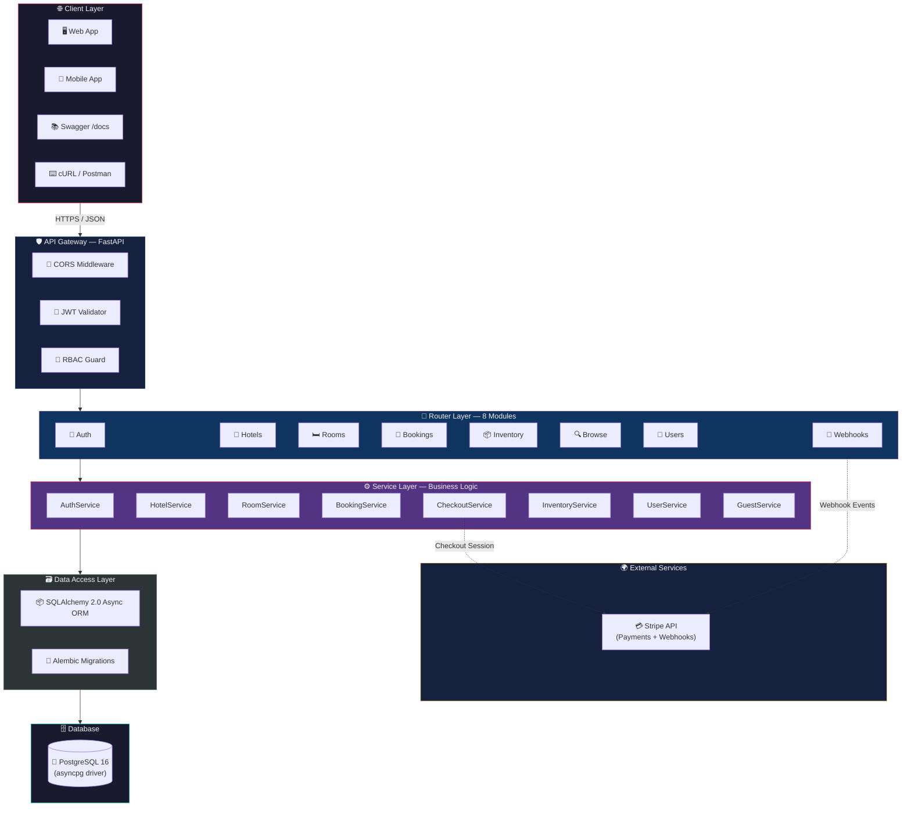

---

## 3. Component Architecture

### 3.1 Component Legend

| Symbol | Component Type           | Description                            |
| ------ | ------------------------ | -------------------------------------- |
| 🛡️     | **Gateway / Middleware** | Request interception, validation, auth |
| 📡     | **Router**               | HTTP endpoint handler, request routing |
| ⚙️     | **Service**              | Business logic, orchestration          |
| 📦     | **ORM Model**            | Database entity mapping                |
| 🗄️     | **Database**             | Persistent data store                  |
| 💳     | **External API**         | Third-party integration                |
| 🔐     | **Security**             | Authentication, authorization          |
| 📐     | **Migration**            | Schema versioning                      |

### 3.2 Router → Service Mapping

| 📡 Router                       | ⚙️ Service(s)                       | Role                              | Access Level     |
| ------------------------------- | ----------------------------------- | --------------------------------- | ---------------- |
| `🔑 /auth/*`                    | `AuthService`                       | Login, signup, token refresh      | 🔓 Public        |
| `🏨 /admin/hotels/*`            | `HotelService`                      | Hotel CRUD, activation            | 🔒 HOTEL_MANAGER |
| `🛏️ /admin/hotels/{id}/rooms/*` | `RoomService`                       | Room CRUD, inventory init         | 🔒 HOTEL_MANAGER |
| `📦 /admin/inventory/*`         | `InventoryService`                  | Availability & pricing management | 🔒 HOTEL_MANAGER |
| `📅 /bookings/*`                | `BookingService`, `CheckoutService` | Full booking lifecycle            | 🔒 Authenticated |
| `🔍 /hotels/*`                  | `HotelService`, `InventoryService`  | Public search & browsing          | 🔓 Public        |
| `👤 /users/*`                   | `UserService`, `GuestService`       | Profile & guest management        | 🔒 Authenticated |
| `🔗 /webhooks/*`                | `CheckoutService`                   | Stripe payment callbacks          | 🔓 Stripe-signed |

### 3.3 Service Dependencies

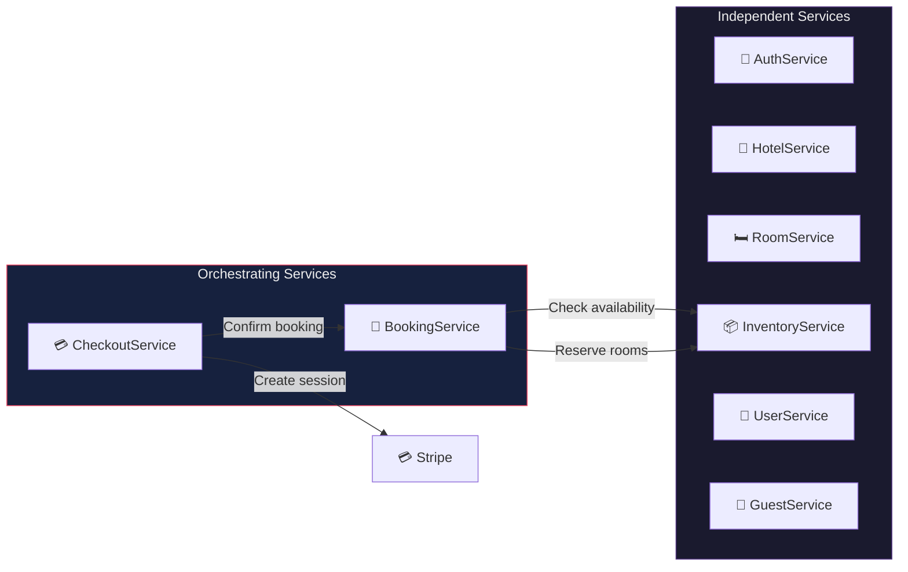

---

## 4. Database Design

### 4.1 Entity Relationship Diagram

<p align="center">
  
</p>

### 4.2 Table Summary

| 📦 Table           | Purpose                      | Key Columns                                       | Indexes          |
| ------------------ | ---------------------------- | ------------------------------------------------- | ---------------- |
| `👤 app_user`      | User accounts & auth         | `email` (UQ), `password`, `roles[]`               | `email` (unique) |
| `🏨 hotel`         | Hotel properties             | `name`, `city`, `active`, `owner_id` (FK→user)    | `city`           |
| `🛏️ room`          | Room types per hotel         | `type`, `base_price`, `capacity`, `hotel_id` (FK) | —                |
| `📊 inventory`     | Daily room availability      | `date`, `price`, `book_count`, `reserved_count`   | `date`, `city`   |
| `📋 booking`       | Reservations                 | `check_in`, `check_out`, `status`, `amount`       | `user_id`        |
| `👥 guest`         | Guest profiles               | `name`, `gender`, `age`, `user_id` (FK)           | —                |
| `🔗 booking_guest` | M:N junction (booking↔guest) | `booking_id` (PK,FK), `guest_id` (PK,FK)          | Composite PK     |

### 4.3 Unique Constraints

| Constraint                        | Table       | Purpose                          |
| --------------------------------- | ----------- | -------------------------------- |
| `UNIQUE(hotel_id, room_id, date)` | `inventory` | One record per room type per day |
| `UNIQUE(email)`                   | `app_user`  | No duplicate accounts            |
| `UNIQUE(payment_session_id)`      | `booking`   | Idempotent payment processing    |

### 4.4 Enum Types

| Enum            | Values                                                                                   | Used In                           |
| --------------- | ---------------------------------------------------------------------------------------- | --------------------------------- |
| `BookingStatus` | `RESERVED` → `GUESTS_ADDED` → `PAYMENTS_PENDING` → `CONFIRMED` / `CANCELLED` / `EXPIRED` | `booking.booking_status`          |
| `Role`          | `GUEST`, `HOTEL_MANAGER`                                                                 | `app_user.roles[]`                |
| `Gender`        | `MALE`, `FEMALE`                                                                         | `app_user.gender`, `guest.gender` |

---

## 5. Authentication & Authorization

### 5.1 JWT Authentication Flow

```mermaid
sequenceDiagram
    autonumber
    participant C as 🖥️ Client
    participant GW as 🛡️ Gateway
    participant AS as 🔑 AuthService
    participant SEC as 🔐 Security
    participant DB as 🗄️ PostgreSQL

    rect rgb(30, 40, 60)
        Note over C,DB: 1️⃣ LOGIN
        C->>+GW: POST /auth/login {email, password}
        GW->>+AS: authenticate()
        AS->>+DB: SELECT user WHERE email = ?
        DB-->>-AS: User record
        AS->>+SEC: verify_password(bcrypt, 12 rounds)
        SEC-->>-AS: ✅ Match
        AS->>SEC: create_tokens(user_id, roles)
        SEC-->>AS: {access_token (30m), refresh_token (7d)}
        AS-->>-GW: TokenResponse
        GW-->>-C: 200 OK {tokens}
    end

    rect rgb(40, 50, 70)
        Note over C,DB: 2️⃣ AUTHENTICATED REQUEST
        C->>+GW: GET /users/profile — Bearer <token>
        GW->>+SEC: decode_jwt(token)
        SEC-->>-GW: {user_id, roles}
        GW->>GW: RBAC check (role ∈ required_roles?)
        GW->>+DB: SELECT user WHERE id = ?
        DB-->>-GW: User data
        GW-->>-C: 200 OK {profile}
    end

    rect rgb(30, 60, 40)
        Note over C,DB: 3️⃣ TOKEN REFRESH
        C->>+GW: POST /auth/refresh {refresh_token}
        GW->>+SEC: validate_refresh_token()
        SEC-->>-GW: ✅ Valid — {user_id}
        GW->>SEC: create_access_token(user_id)
        SEC-->>GW: {new_access_token}
        GW-->>-C: 200 OK {token}
    end
```

### 5.2 RBAC Permission Matrix

| Resource                 | 🔓 Public             | 👤 GUEST | 🏨 HOTEL_MANAGER |
| ------------------------ | --------------------- | -------- | ---------------- |
| `POST /auth/signup`      | ✅                    | ✅       | ✅               |
| `POST /auth/login`       | ✅                    | ✅       | ✅               |
| `GET /hotels/search`     | ✅                    | ✅       | ✅               |
| `GET /users/profile`     | ❌                    | ✅       | ✅               |
| `POST /bookings/init`    | ❌                    | ✅       | ✅               |
| `POST /admin/hotels`     | ❌                    | ❌       | ✅               |
| `PATCH /admin/inventory` | ❌                    | ❌       | ✅               |
| `POST /webhooks/stripe`  | ✅ (Stripe signature) | —        | —                |

### 5.3 Token Lifecycle

```
┌──────────────────────────────────────────────────────┐
│                🔐 Token Configuration                 │
├───────────────────┬──────────────────────────────────┤
│ Access Token      │ JWT, HS256, 30 min expiry        │
│ Refresh Token     │ JWT, HS256, 7 day expiry         │
│ Password Hash     │ bcrypt, 12 salt rounds           │
│ Token Payload     │ {sub: user_id, roles[], exp, type}│
└───────────────────┴──────────────────────────────────┘
```

---

## 6. Core Business Flows

### 6.1 Booking Lifecycle State Machine

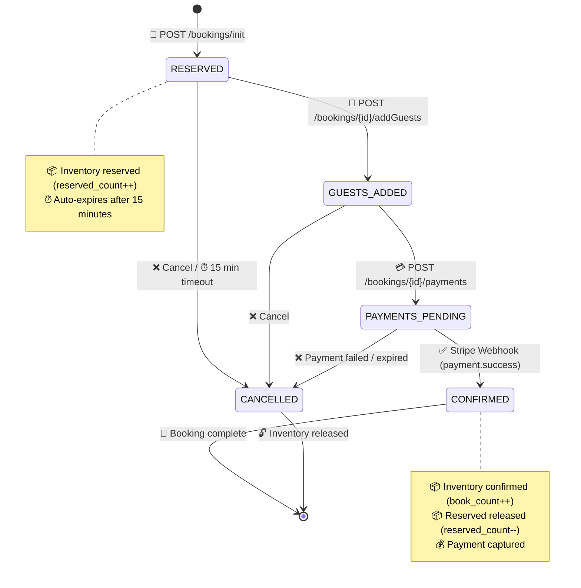

### 6.2 Booking Flow — Detailed Sequence

<p align="center">
  
</p>

### 6.3 Inventory Calculation

```
┌────────────────────────────────────────────────────────────────┐
│                📊 Inventory Formula (per room type, per day)    │
├────────────────────────────────────────────────────────────────┤
│                                                                │
│   available_count = total_count − book_count − reserved_count  │
│                                                                │
│   final_price = base_price × surge_factor                      │
│                                                                │
│   Example:                                                     │
│   ┌────────────┬──────────┬──────────┬───────────┬──────────┐  │
│   │ total: 10  │ booked: 3│ reserved:2│ available:5│ closed:F│  │
│   ├────────────┴──────────┴──────────┴───────────┴──────────┤  │
│   │ base: $200 × surge: 1.5 = final: $300/night             │  │
│   └─────────────────────────────────────────────────────────┘  │
└────────────────────────────────────────────────────────────────┘
```

### 6.4 Payment Integration (Stripe)

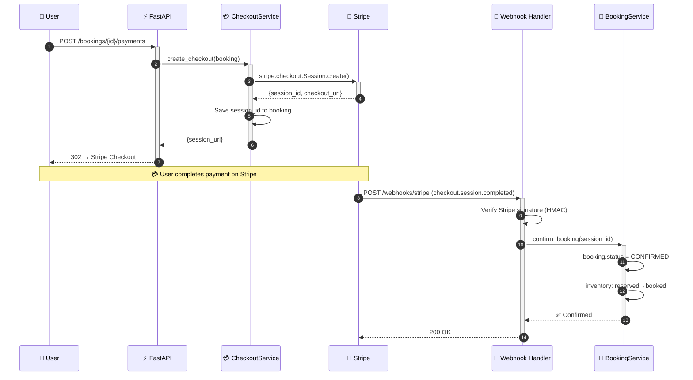

---

## 7. API Design

### 7.1 RESTful Conventions

| Method   | Semantics      | Example                          | Response         |
| -------- | -------------- | -------------------------------- | ---------------- |
| `GET`    | 📖 Read        | `GET /hotels/1`                  | `200 OK`         |
| `POST`   | ➕ Create      | `POST /admin/hotels`             | `201 Created`    |
| `PUT`    | 🔄 Full Update | `PUT /admin/hotels/1`            | `200 OK`         |
| `PATCH`  | ✏️ Partial     | `PATCH /admin/hotels/1/activate` | `200 OK`         |
| `DELETE` | 🗑️ Delete      | `DELETE /admin/hotels/1`         | `204 No Content` |

### 7.2 URL Namespace

```
🔓 Public:
  POST   /auth/signup                  # Create account
  POST   /auth/login                   # Get tokens
  GET    /hotels/search?city=&date=    # Search hotels
  GET    /hotels/{id}/info             # Hotel details

🔒 Authenticated (GUEST):
  GET    /users/profile                # View profile
  POST   /bookings/init                # New booking
  POST   /bookings/{id}/addGuests      # Add guests
  POST   /bookings/{id}/payments       # Pay via Stripe

🔒 Authenticated (HOTEL_MANAGER):
  POST   /admin/hotels                 # Create hotel
  PATCH  /admin/hotels/{id}/activate   # Activate hotel
  POST   /admin/hotels/{id}/rooms      # Add rooms
  PATCH  /admin/inventory/{id}         # Update pricing

🔗 Webhooks:
  POST   /webhooks/stripe              # Payment callbacks
```

### 7.3 Error Response Format

```json
{
  "detail": "Booking not found: 42"
}
```

| Code  | Meaning             | Example Scenario            |
| ----- | ------------------- | --------------------------- |
| `200` | ✅ Success          | Data returned               |
| `201` | ✅ Created          | Hotel/booking created       |
| `400` | ❌ Bad Request      | Invalid date range          |
| `401` | 🔒 Unauthorized     | Missing/expired token       |
| `403` | 🚫 Forbidden        | GUEST accessing /admin      |
| `404` | 🔍 Not Found        | Hotel/booking doesn't exist |
| `422` | ⚠️ Validation Error | Pydantic schema mismatch    |
| `429` | ⏳ Rate Limited     | Too many requests           |
| `500` | 💥 Server Error     | Unhandled exception         |

---

## 8. Non-Functional Requirements

### 8.1 Performance Targets

| Metric                 | Target  | Measurement                   |
| ---------------------- | ------- | ----------------------------- |
| 🚀 API Response (p50)  | < 100ms | Avg endpoint latency          |
| 🚀 API Response (p99)  | < 500ms | Tail latency                  |
| 📊 Throughput          | 500 RPS | Concurrent requests/sec       |
| 🗄️ DB Query Time (p95) | < 50ms  | SQLAlchemy query execution    |
| 💳 Payment Webhook     | < 5s    | Stripe → Confirmation latency |

### 8.2 Availability & Reliability

| Metric                   | Target                     |
| ------------------------ | -------------------------- |
| ⬆️ Uptime SLA            | 99.9% (8.7h downtime/year) |
| 🔄 Recovery Time (RTO)   | < 15 minutes               |
| 💾 Recovery Point (RPO)  | < 1 minute                 |
| 🏥 Health Check Interval | Every 30s                  |
| 🔁 Zero-Downtime Deploys | ✅ Blue-green              |

### 8.3 Scalability Thresholds

| Metric              | Current | Trigger for Scaling            |
| ------------------- | ------- | ------------------------------ |
| 👥 Concurrent Users | 100     | > 500 → Add API replicas       |
| 🗄️ DB Connections   | 20 pool | > 80% utilization → Scale pool |
| 📦 Storage          | 1 GB    | > 50 GB → Evaluate sharding    |
| 📈 API Instances    | 1       | > 70% CPU → Auto-scale         |

---

## 9. Capacity Planning & Estimates

### 9.1 Traffic Estimates

| Metric                 | Daily       | Monthly      |
| ---------------------- | ----------- | ------------ |
| 🔍 Search Requests     | 10,000      | 300,000      |
| 📅 Booking Initiations | 500         | 15,000       |
| 💳 Payments Processed  | 200         | 6,000        |
| 🔑 Auth Requests       | 2,000       | 60,000       |
| **Total API Calls**    | **~15,000** | **~450,000** |

### 9.2 Storage Projections

| Table       | Row Size (avg) | Rows/Year | Annual Storage   |
| ----------- | -------------- | --------- | ---------------- |
| `app_user`  | 512 bytes      | 10,000    | ~5 MB            |
| `hotel`     | 1 KB           | 500       | ~500 KB          |
| `room`      | 512 bytes      | 2,500     | ~1.3 MB          |
| `inventory` | 256 bytes      | 912,500   | ~234 MB          |
| `booking`   | 512 bytes      | 72,000    | ~37 MB           |
| **Total**   |                |           | **~280 MB/year** |

### 9.3 Connection Pool Sizing

```
Pool Size Formula:
  connections = (2 × CPU_cores) + effective_spindle_count

  For 4-core server:
    pool_size = (2 × 4) + 1 = 9 (round to 10)
    max_overflow = 10
    Total possible: 20 connections
```

---

## 10. Security Architecture

### 10.1 Threat Model

| Threat                  | Risk | Mitigation                                        |
| ----------------------- | ---- | ------------------------------------------------- |
| 🔓 SQL Injection        | High | SQLAlchemy ORM (parameterized queries)            |
| 🔓 XSS                  | Med  | Pydantic validation, JSON-only responses          |
| 🔓 CSRF                 | Med  | Token-based auth (no cookies for auth)            |
| 🔓 Brute Force Login    | High | Rate limiting (100 req/min/user)                  |
| 🔓 Password Leak        | High | bcrypt (12 rounds), never stored in plaintext     |
| 🔓 Token Theft          | Med  | Short expiry (30m), HTTPS only                    |
| 🔓 Stripe Spoofing      | High | Webhook signature verification (HMAC-SHA256)      |
| 🔓 Privilege Escalation | Med  | Role checked per-request via dependency injection |

### 10.2 Data Protection

```
┌─────────────────────────────────────────────────────┐
│              🔐 Security Layers                      │
├─────────────────────────────────────────────────────┤
│ Transport │ HTTPS / TLS 1.3                         │
│ Auth      │ JWT (HS256) + bcrypt passwords          │
│ AuthZ     │ RBAC (dependency-injected guards)       │
│ Payments  │ Stripe handles PCI DSS compliance       │
│ Secrets   │ Environment variables (.env)            │
│ Input     │ Pydantic v2 strict validation           │
│ DB Access │ ORM (no raw SQL)                        │
└─────────────────────────────────────────────────────┘
```

---

## 11. Deployment Architecture

### 11.1 CI/CD Pipeline

<p align="center">
  
</p>

| Stage     | Tool                   | What it does                               |
| --------- | ---------------------- | ------------------------------------------ |
| 🔍 Lint   | Ruff                   | Code style, import sorting, common bugs    |
| 🧪 Test   | Pytest + PostgreSQL 16 | 56 tests with service container + coverage |
| 🐳 Build  | Docker Buildx          | Multi-stage build with layer caching       |
| 📦 Push   | GHCR                   | `ghcr.io/pankajshakya627/airbnb:latest`    |
| 🚀 Deploy | Configurable           | SSH, AWS ECS, or Railway (placeholder)     |

### 11.2 Docker Architecture

```dockerfile
# Multi-stage build
FROM python:3.12-slim AS builder    # 📦 Install dependencies
FROM python:3.12-slim               # 🏃 Runtime (minimal image)
HEALTHCHECK --interval=30s CMD curl -f http://localhost:8000/health
CMD ["uvicorn", "app.main:app", "--host", "0.0.0.0", "--port", "8000"]
```

### 11.3 Environment Matrix

| Environment    | Database        | Stripe Key  | Docker         |
| -------------- | --------------- | ----------- | -------------- |
| 🟢 Development | localhost:5432  | `sk_test_*` | docker-compose |
| 🟡 Staging     | staging-db:5432 | `sk_test_*` | GHCR image     |
| 🔴 Production  | prod-db:5432    | `sk_live_*` | GHCR image     |

---

## 12. Scalability Roadmap

### 12.1 Current → Future Architecture

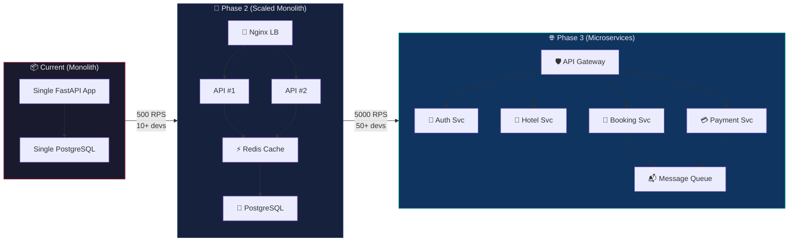

### 12.2 Migration Triggers

| Trigger                   | Action                                |
| ------------------------- | ------------------------------------- |
| > 500 concurrent users    | Add API replicas behind load balancer |
| > 80% DB CPU              | Add read replicas                     |
| > 10 developers           | Split into domain microservices       |
| Global user base          | Geographic database sharding          |
| > 1000 RPS search         | Add Elasticsearch                     |
| Notification requirements | Add message queue (RabbitMQ / Kafka)  |

---

## 13. Technology Stack

| Category             | Technology                       | Symbol |
| -------------------- | -------------------------------- | ------ |
| **Framework**        | FastAPI (Python 3.12)            | ⚡     |
| **Database**         | PostgreSQL 16                    | 🐘     |
| **ORM**              | SQLAlchemy 2.0 (Async + asyncpg) | 📦     |
| **Migrations**       | Alembic                          | 📐     |
| **Validation**       | Pydantic v2                      | ✅     |
| **Testing**          | Pytest + HTTPX (77% coverage)    | 🧪     |
| **Payments**         | Stripe API                       | 💳     |
| **Auth**             | JWT (PyJWT) + bcrypt             | 🔐     |
| **Containerization** | Docker + Docker Compose          | 🐳     |
| **CI/CD**            | GitHub Actions                   | ⚙️     |
| **Linting**          | Ruff                             | 🔍     |
| **Registry**         | GitHub Container Registry (GHCR) | 📦     |

---

## 14. System Design Concepts

### 14.1 CAP Theorem

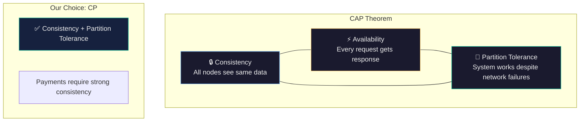

**Our Decision**: **CP (Consistency + Partition Tolerance)** — Financial transactions must be consistent; a booking must never be double-sold.

### 14.2 ACID Properties in Booking Transactions

| Property           | How We Implement It                                  |
| ------------------ | ---------------------------------------------------- |
| **🔷 Atomicity**   | All inventory updates within a single DB transaction |
| **🔷 Consistency** | Unique constraints, FK constraints, enum validation  |
| **🔷 Isolation**   | `SELECT ... FOR UPDATE` row-level locking            |
| **🔷 Durability**  | PostgreSQL WAL (Write-Ahead Log), fsync              |

### 14.3 Caching Strategy (Future)

```
┌─────────────────────────────────────────────────┐
│  L1: Application Cache (in-memory)              │
│  TTL: 1 min │ Data: User sessions               │
├─────────────────────────────────────────────────┤
│  L2: Redis Cache (distributed)                  │
│  TTL: 5 min │ Data: Hotel search, room listings │
├─────────────────────────────────────────────────┤
│  L3: PostgreSQL (source of truth)               │
└─────────────────────────────────────────────────┘
```

### 14.4 Database Indexing Strategy

| Index                | Column(s)                   | Type      | Purpose                     |
| -------------------- | --------------------------- | --------- | --------------------------- |
| `ix_user_email`      | `app_user.email`            | B-Tree UQ | Fast login lookup           |
| `ix_hotel_city`      | `hotel.city`                | B-Tree    | City-based search           |
| `ix_inventory_date`  | `inventory.date`            | B-Tree    | Date range queries          |
| `ix_inventory_city`  | `inventory.city`            | B-Tree    | Availability by city        |
| `uq_hotel_room_date` | `(hotel_id, room_id, date)` | Composite | Prevent duplicate inventory |

### 14.5 Circuit Breaker Pattern (Stripe)

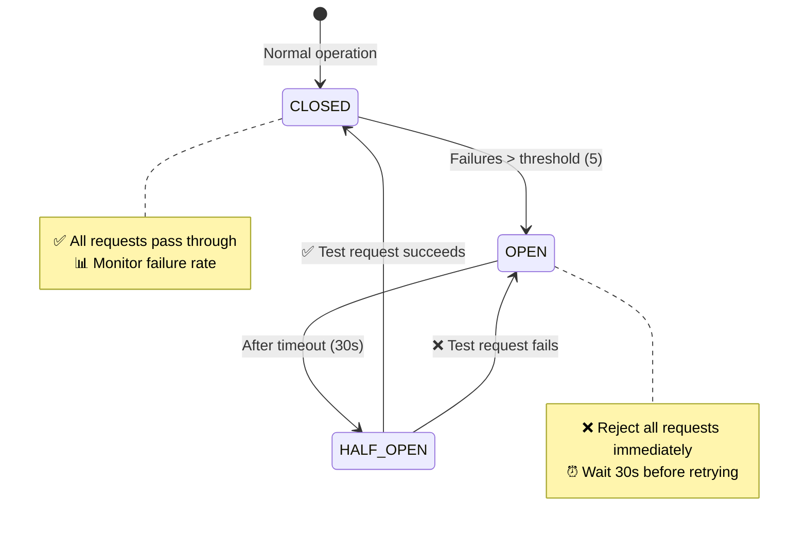

### 14.6 Saga Pattern for Distributed Bookings

```mermaid
sequenceDiagram
    participant O as 🎯 Orchestrator
    participant I as 📦 Inventory
    participant P as 💳 Payment
    participant B as 📅 Booking

    rect rgb(30, 60, 40)
        Note over O,B: ✅ SUCCESS PATH
        O->>I: 1. Reserve inventory
        I-->>O: ✅ Reserved
        O->>P: 2. Process payment
        P-->>O: ✅ Charged
        O->>B: 3. Confirm booking
        B-->>O: ✅ Confirmed
    end

    rect rgb(60, 30, 30)
        Note over O,B: ❌ FAILURE → COMPENSATION
        O->>I: 1. Reserve inventory
        I-->>O: ✅ Reserved
        O->>P: 2. Process payment
        P-->>O: ❌ Failed
        O->>I: COMPENSATE: Release inventory
        I-->>O: ✅ Released
    end
```

### 14.7 Event-Driven Architecture (Future)

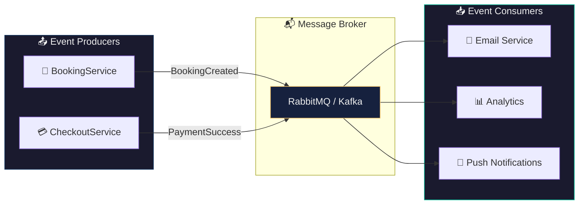

### 14.8 Horizontal vs Vertical Scaling

| Aspect         | 📈 Vertical (Scale Up) | 📊 Horizontal (Scale Out) |
| -------------- | ---------------------- | ------------------------- |
| **Method**     | Bigger server          | More servers              |
| **Cost**       | Expensive hardware     | Commodity servers         |
| **Limit**      | Hardware ceiling       | Virtually unlimited       |
| **Complexity** | Simple                 | Requires load balancing   |
| **Downtime**   | Required for upgrades  | Zero-downtime possible    |

**Our Approach**: Horizontal scaling with stateless API servers + load balancer.

### 14.9 Database Replication

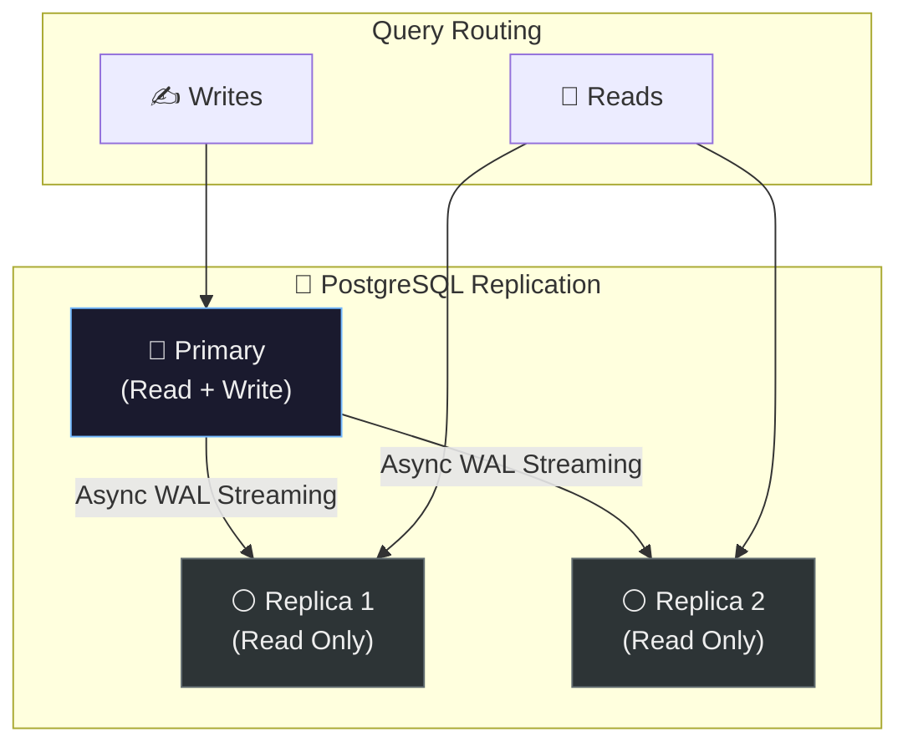

---

## 15. Interview Questions & Answers

### 15.1 Architecture & Design

#### Q1: Why a layered monolith?

**Separation of Concerns** — Each layer has a single responsibility. **Testability** — Layers tested independently. **Maintainability** — Swapping PostgreSQL only affects data layer. Split into microservices when team > 10 devs or scaling needs diverge.

#### Q2: How to handle 1M concurrent booking requests?

1. **Horizontal Scaling** — N API instances behind Nginx
2. **Redis Caching** — Hotel search results (TTL: 5min)
3. **DB Read Replicas** — Offload search queries
4. **Message Queue** — Async booking processing
5. **Rate Limiting** — Token bucket (100 req/min/user)

#### Q3: Why FastAPI over Django/Flask?

| Feature         | FastAPI     | Flask  | Django     |
| --------------- | ----------- | ------ | ---------- |
| Async Native    | ✅          | ❌     | ⚠️ Partial |
| Auto Docs       | ✅ Swagger  | ❌     | ❌         |
| Type Validation | ✅ Pydantic | ❌     | ❌         |
| Performance     | ⭐⭐⭐⭐⭐  | ⭐⭐⭐ | ⭐⭐       |

### 15.2 Database Design

#### Q4: Why separate Inventory from Room?

**Normalization** — Room is static (type, capacity), Inventory is dynamic (daily price, availability). Enables **dynamic pricing** per day, **historical tracking**, and **no schema changes** when adding dates.

#### Q5: How to prevent double booking?

1. `SELECT ... FOR UPDATE` — Row-level pessimistic locking
2. Atomic update: `UPDATE inventory SET reserved_count = reserved_count + 1 WHERE available > 0`
3. `UNIQUE(hotel_id, room_id, date)` constraint
4. Application-level: Reserve → Pay → Confirm (with 15min timeout)

#### Q6: Database sharding strategy?

**Geographic sharding by city/region** — US shard, EU shard, APAC shard. Cross-shard search via Elasticsearch index.

### 15.3 Security

#### Q7: Why JWT over sessions?

| Aspect      | JWT                    | Sessions                  |
| ----------- | ---------------------- | ------------------------- |
| Stateless   | ✅ No server storage   | ❌ Requires session store |
| Scalability | ✅ Any server verifies | ❌ Need shared store      |
| Revocation  | ❌ Use short expiry    | ✅ Easy to invalidate     |

#### Q8: Attack protection?

| Attack          | Protection                             |
| --------------- | -------------------------------------- |
| SQL Injection   | SQLAlchemy ORM (parameterized queries) |
| XSS             | Pydantic validation, JSON responses    |
| Brute Force     | Rate limiting, bcrypt (12 rounds)      |
| Token Theft     | Short expiry (30min), HTTPS only       |
| Stripe Spoofing | Webhook HMAC-SHA256 signature check    |

### 15.4 Booking & Payments

#### Q9: Why multiple booking statuses?

State machine prevents invalid transitions: `RESERVED → GUESTS_ADDED → PAYMENTS_PENDING → CONFIRMED`. Each state has specific inventory operations and timeout behaviors.

#### Q10: Payment failure handling?

1. `checkout.session.completed` → CONFIRMED
2. `checkout.session.expired` → CANCELLED (inventory released)
3. Idempotency via `payment_session_id` (UNIQUE constraint)

#### Q11: Server crash mid-booking?

1. **DB Transactions** — Atomic inventory updates (rollback on failure)
2. **Compensating Actions** — Background job releases stale reservations after 15min
3. **Saga Pattern** — Orchestrated compensation for distributed failures

### 15.5 Quick Fire

| Question                  | Answer                                         |
| ------------------------- | ---------------------------------------------- |
| CAP theorem choice?       | CP — Payments require strong consistency       |
| SQL vs NoSQL?             | SQL — ACID transactions for financial data     |
| Sync vs Async processing? | Async for payments (webhooks), sync for search |
| Pagination strategy?      | Offset-based; cursor-based at scale            |
| API rate limiting?        | Token bucket: 100 req/min/user                 |
| Password storage?         | bcrypt, 12 salt rounds                         |
| Secrets management?       | .env → HashiCorp Vault (production)            |
| Database migrations?      | Alembic with version control                   |
| Testing strategy?         | Unit → Integration → E2E pyramid               |
| CI/CD pipeline?           | GitHub Actions → Docker → GHCR                 |
| Monitoring?               | Prometheus + Grafana + ELK + Jaeger            |

---

<div align="center">

**Document Version: 2.0** | **Last Updated: 2026-02-17** | **Status: ✅ Approved**

_Built with ⚡ FastAPI • 🐘 PostgreSQL • 💳 Stripe • 🐳 Docker_

</div>
