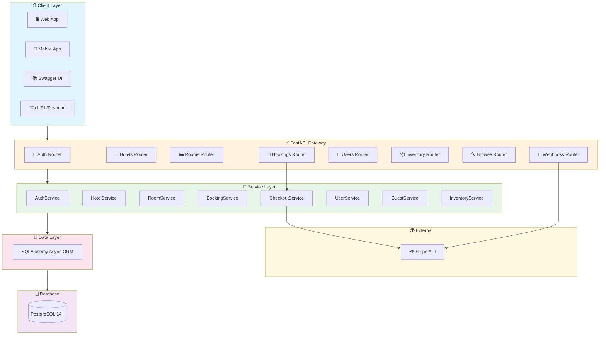
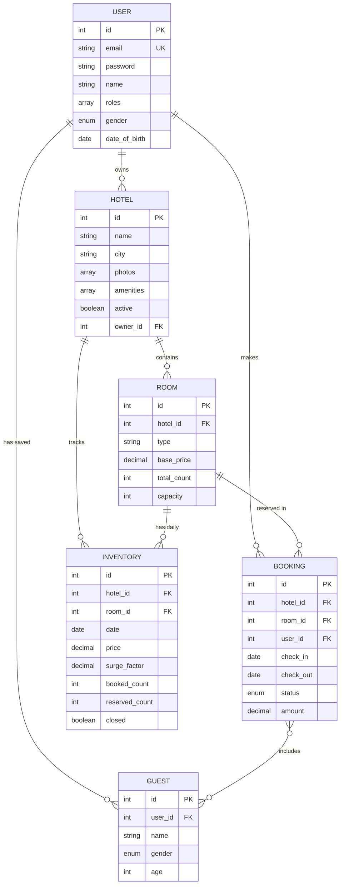
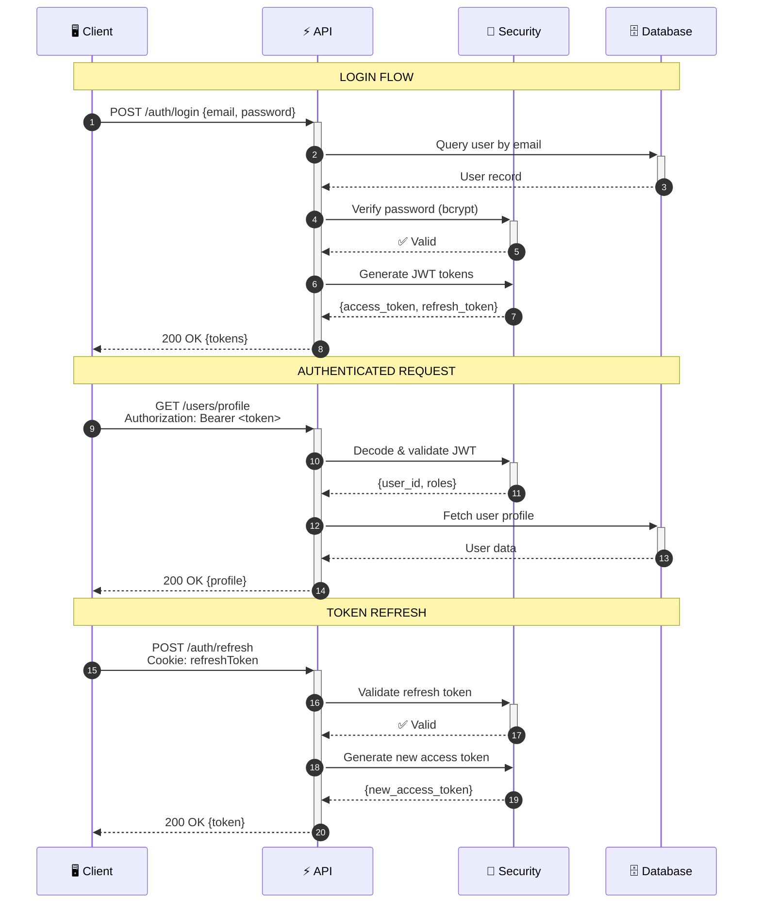
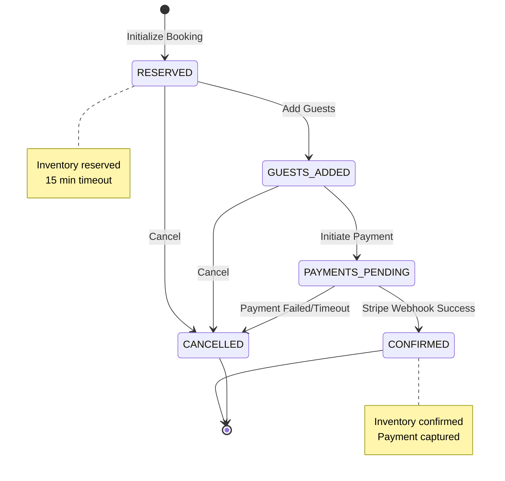
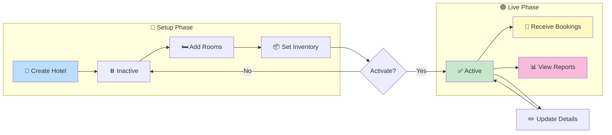
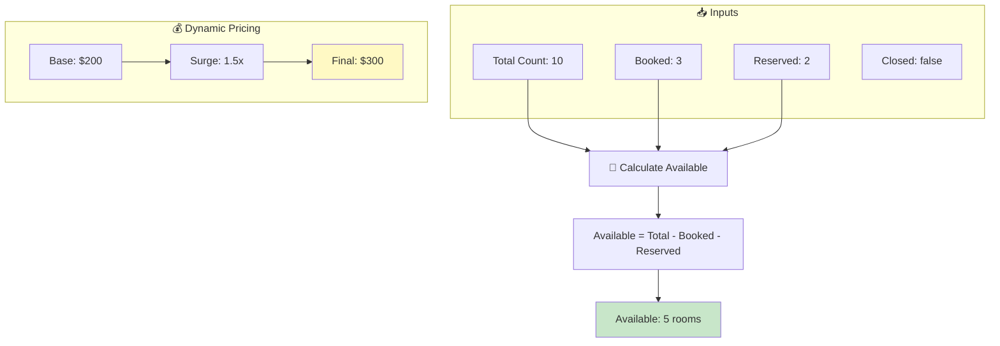
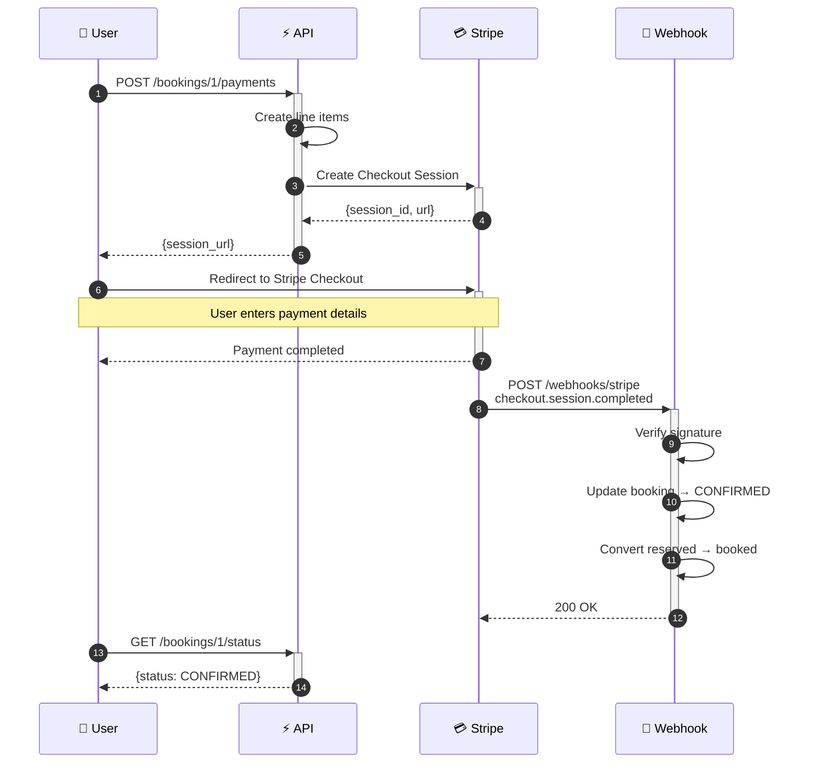

# High-Level Design (HLD) Document

## AirBnb Hotel Booking System - FastAPI Backend

---

## 1. Executive Summary

This document provides a comprehensive High-Level Design (HLD) for the AirBnb Hotel Booking System backend. The system is a production-ready RESTful API built with **FastAPI** (Python), designed to handle hotel management, room inventory, user authentication, and complete booking workflows with integrated payment processing.

### Key Highlights

- **Architecture**: Layered architecture with clear separation of concerns
- **Database**: PostgreSQL with async SQLAlchemy ORM
- **Authentication**: JWT-based with role-based access control (RBAC)
- **Payments**: Stripe integration for secure checkout
- **Scalability**: Async I/O throughout for high concurrency

---

## 2. System Architecture

### 2.1 Architecture Diagram

```
┌────────────────────────────────────────────────────────────────┐
│                        CLIENT LAYER                            │
│  ┌──────────┐  ┌──────────┐  ┌──────────┐  ┌──────────┐        │
│  │  Web App │  │Mobile App│  │  Swagger │  │   cURL   │        │
│  └────┬─────┘  └────┬─────┘  └────┬─────┘  └────┬─────┘        │
└───────┼─────────────┼─────────────┼─────────────┼──────────────┘
        │             │             │             │
        └─────────────┴──────┬──────┴─────────────┘
                             │ HTTPS
┌────────────────────────────┼────────────────────────────────────┐
│                    API GATEWAY LAYER                            │
│  ┌─────────────────────────┴─────────────────────────────────┐  │
│  │                    FastAPI Application                    │  │
│  │  ┌─────────────────────────────────────────────────────┐  │  │
│  │  │                    Routers (8)                      │  │  │
│  │  │  ┌────────┐ ┌────────┐ ┌────────┐ ┌────────────┐    │  │  │
│  │  │  │  Auth  │ │ Hotels │ │ Rooms  │ │  Bookings  │    │  │  │
│  │  │  ├────────┤ ├────────┤ ├────────┤ ├────────────┤    │  │  │
│  │  │  │ Users  │ │Inventory│ │ Browse │ │  Webhooks │    │  │  │
│  │  │  └────────┘ └────────┘ └────────┘ └────────────┘    │  │  │
│  │  └─────────────────────────────────────────────────────┘  │  │
│  └───────────────────────────────────────────────────────────┘  │
└─────────────────────────────────────────────────────────────────┘
                             │
┌────────────────────────────┼────────────────────────────────────┐
│                    SERVICE LAYER                                │
│  ┌─────────────────────────┴─────────────────────────────────┐  │
│  │                   Business Logic (8 Services)             │  │
│  │  ┌────────────┐ ┌────────────┐ ┌────────────────────────┐ │  │
│  │  │AuthService │ │HotelService│ │    BookingService      │ │  │
│  │  ├────────────┤ ├────────────┤ ├────────────────────────┤ │  │
│  │  │RoomService │ │InventorySvc│ │   CheckoutService      │ │  │
│  │  ├────────────┤ ├────────────┤ ├────────────────────────┤ │  │
│  │  │UserService │ │GuestService│ │                        │ │  │
│  │  └────────────┘ └────────────┘ └────────────────────────┘ │  │
│  └───────────────────────────────────────────────────────────┘  │
└─────────────────────────────────────────────────────────────────┘
                             │
┌────────────────────────────┼────────────────────────────────────┐
│                    DATA ACCESS LAYER                            │
│  ┌─────────────────────────┴─────────────────────────────────┐  │
│  │              SQLAlchemy Async ORM (7 Models)              │  │
│  │  ┌──────┐ ┌───────┐ ┌──────┐ ┌─────────┐ ┌─────────────┐  │  │
│  │  │ User │ │ Hotel │ │ Room │ │Inventory│ │   Booking   │  │  │
│  │  └──────┘ └───────┘ └──────┘ └─────────┘ └─────────────┘  │  │
│  │  ┌───────┐ ┌──────────────┐                               │  │
│  │  │ Guest │ │HotelMinPrice │                               │  │
│  │  └───────┘ └──────────────┘                               │  │
│  └───────────────────────────────────────────────────────────┘  │
└─────────────────────────────────────────────────────────────────┘
                             │
┌────────────────────────────┼────────────────────────────────────┐
│                    DATABASE LAYER                               │
│  ┌─────────────────────────┴─────────────────────────────────┐  │
│  │                   PostgreSQL 14+                          │  │
│  │        (asyncpg driver for async connections)             │  │
│  └───────────────────────────────────────────────────────────┘  │
└─────────────────────────────────────────────────────────────────┘
                             │
┌────────────────────────────┴────────────────────────────────────┐
│                    EXTERNAL SERVICES                            │
│  ┌───────────────────┐                                          │
│  │    Stripe API     │  (Payment Processing & Webhooks)         │
│  └───────────────────┘                                          │
└─────────────────────────────────────────────────────────────────┘
```

### 2.1.1 Interactive Architecture Diagram



### 2.2 Layer Responsibilities

| Layer           | Responsibility                | Components                        |
| --------------- | ----------------------------- | --------------------------------- |
| **Client**      | User interaction              | Web/Mobile apps, Swagger UI       |
| **API Gateway** | Request routing, validation   | FastAPI routers, Pydantic schemas |
| **Service**     | Business logic, orchestration | 8 service classes                 |
| **Data Access** | ORM, database operations      | SQLAlchemy models                 |
| **Database**    | Data persistence              | PostgreSQL                        |
| **External**    | Third-party integrations      | Stripe payments                   |

---

## 3. Database Design

### 3.1 Entity-Relationship Diagram

```
┌──────────────┐       ┌──────────────┐       ┌──────────────┐
│   app_user   │       │    hotel     │       │     room     │
├──────────────┤       ├──────────────┤       ├──────────────┤
│ id (PK)      │──┐    │ id (PK)      │──┐    │ id (PK)      │
│ email        │  │    │ name         │  │    │ hotel_id(FK) │──┐
│ password     │  │    │ city         │  │    │ type         │  │
│ name         │  │    │ photos[]     │  │    │ base_price   │  │
│ roles[]      │  │    │ amenities[]  │  │    │ total_count  │  │
│ gender       │  │    │ active       │  │    │ capacity     │  │
│ date_of_birth│  │    │ owner_id(FK) │──┘    │ amenities[]  │  │
└──────────────┘  │    │ contact_*    │       └──────────────┘  │
                  │    └──────────────┘                         │
                  │           │                                 │
                  │           │                                 │
┌──────────────┐  │    ┌──────┴───────┐       ┌──────────────┐  │
│    guest     │  │    │  inventory   │       │   booking    │  │
├──────────────┤  │    ├──────────────┤       ├──────────────┤  │
│ id (PK)      │  │    │ id (PK)      │       │ id (PK)      │  │
│ user_id (FK) │──┘    │ hotel_id(FK) │       │ hotel_id(FK) │──┘
│ name         │       │ room_id (FK) │───────│ room_id (FK) │
│ gender       │       │ date         │       │ user_id (FK) │
│ age          │       │ price        │       │ check_in     │
└──────────────┘       │ surge_factor │       │ check_out    │
       │               │ total_count  │       │ status       │
       │               │ book_count   │       │ amount       │
       └───────────────│ reserved_cnt │       └──────────────┘
                       │ closed       │              │
                       │ city         │              │
                       └──────────────┘              │
                                                     │
                              ┌───────────────┐      │
                              │ booking_guest │      │
                              ├───────────────┤      │
                              │ booking_id(FK)│──────┘
                              │ guest_id (FK) │
                              └───────────────┘
```

### 3.1.1 Interactive ER Diagram



### 3.2 Table Descriptions

| Table             | Purpose                 | Key Fields                      |
| ----------------- | ----------------------- | ------------------------------- |
| `app_user`        | User accounts           | email, password (hashed), roles |
| `hotel`           | Hotel properties        | name, city, owner, amenities    |
| `room`            | Room types per hotel    | type, base_price, capacity      |
| `inventory`       | Daily room availability | date, price, counts             |
| `booking`         | Reservations            | dates, status, amount           |
| `guest`           | Saved guest profiles    | name, age, gender               |
| `hotel_min_price` | Cached minimum prices   | For search optimization         |

---

## 4. Authentication & Authorization

### 4.1 JWT Authentication Flow

```
┌──────────┐          ┌──────────┐          ┌──────────┐
│  Client  │          │   API    │          │   DB     │
└────┬─────┘          └────┬─────┘          └────┬─────┘
     │                     │                     │
     │  POST /auth/login   │                     │
     │  {email, password}  │                     │
     │────────────────────>│                     │
     │                     │  Query user         │
     │                     │────────────────────>│
     │                     │<────────────────────│
     │                     │  Verify password    │
     │                     │  (bcrypt)           │
     │                     │                     │
     │  {access_token,     │                     │
     │   refresh_token}    │                     │
     │<────────────────────│                     │
     │                     │                     │
     │  GET /users/profile │                     │
     │  Authorization:     │                     │
     │  Bearer <token>     │                     │
     │────────────────────>│                     │
     │                     │  Decode JWT         │
     │                     │  Extract user_id    │
     │                     │  Check roles        │
     │                     │────────────────────>│
     │  {user profile}     │<────────────────────│
     │<────────────────────│                     │
```

### 4.1.1 Interactive Auth Sequence



### 4.2 Role-Based Access Control (RBAC)

| Role            | Permissions                                                    |
| --------------- | -------------------------------------------------------------- |
| `GUEST`         | Browse hotels, create bookings, manage own profile/guests      |
| `HOTEL_MANAGER` | All GUEST permissions + create/manage hotels, rooms, inventory |

### 4.3 Security Implementation

```python
# Password Hashing (bcrypt)
def hash_password(password: str) -> str:
    password_bytes = password.encode('utf-8')[:72]  # bcrypt limit
    salt = bcrypt.gensalt(rounds=12)
    return bcrypt.hashpw(password_bytes, salt).decode('utf-8')

# JWT Token Structure
{
    "sub": "user_id",
    "roles": ["GUEST", "HOTEL_MANAGER"],
    "exp": 1770551111,  # 30 min expiry
    "type": "access"
}
```

---

## 5. Core Business Scenarios

### 5.1 Booking Flow

```
┌────────────────────────────────────────────────────────────────┐
│                      BOOKING LIFECYCLE                          │
├────────────────────────────────────────────────────────────────┤
│                                                                 │
│   ┌──────────┐    ┌─────────────┐    ┌──────────────────┐      │
│   │ RESERVED │───>│GUESTS_ADDED │───>│PAYMENTS_PENDING  │      │
│   └──────────┘    └─────────────┘    └────────┬─────────┘      │
│        │                                      │                 │
│        │                              ┌───────┴───────┐        │
│        │                              │               │        │
│        ▼                              ▼               ▼        │
│   ┌──────────┐                   ┌─────────┐   ┌───────────┐   │
│   │CANCELLED │                   │CONFIRMED│   │ CANCELLED │   │
│   └──────────┘                   └─────────┘   └───────────┘   │
│                                                                 │
└────────────────────────────────────────────────────────────────┘
```

### 5.1.1 Interactive Booking State Machine



**Flow Steps:**

1. **Initialize Booking (RESERVED)**
   - User selects hotel, room, dates
   - System checks inventory availability
   - Reserves inventory (increments `reserved_count`)
   - Creates booking with status `RESERVED`

2. **Add Guests (GUESTS_ADDED)**
   - User adds guest profiles to booking
   - System validates guest ownership
   - Updates status to `GUESTS_ADDED`

3. **Payment (PAYMENTS_PENDING → CONFIRMED)**
   - User initiates payment
   - System creates Stripe checkout session
   - On webhook confirmation: `CONFIRMED`
   - Converts reserved to booked inventory

4. **Cancellation**
   - Available before payment completion
   - Releases reserved inventory
   - Sets status to `CANCELLED`

### 5.2 Hotel Management Flow

```
Hotel Lifecycle:

┌────────────┐    ┌────────────┐    ┌────────────┐
│  CREATE    │───>│  INACTIVE  │───>│   ACTIVE   │
│   Hotel    │    │  (setup)   │    │ (bookable) │
└────────────┘    └──────┬─────┘    └────────────┘
                         │                 │
                         │    ┌────────────┤
                         │    │            │
                         ▼    ▼            ▼
                    ┌──────────────┐  ┌─────────┐
                    │ ADD ROOMS    │  │ REPORTS │
                    │ SET INVENTORY│  │ BOOKINGS│
                    └──────────────┘  └─────────┘
```

### 5.2.1 Interactive Hotel Management Flow



### 5.3 Inventory Management

**Theory: Dynamic Pricing with Surge Factor**

```
Final Price = Base Price × Surge Factor

Example:
- Base Price: $200
- Surge Factor: 1.5 (during peak season)
- Final Price: $300
```

**Inventory Structure:**

```
┌────────────────────────────────────────────────────────┐
│                    INVENTORY (per room, per day)        │
├─────────────┬──────────────────────────────────────────┤
│ total_count │ Maximum rooms of this type               │
│ book_count  │ Confirmed bookings                       │
│ reserved_cnt│ Pending reservations                     │
│ available   │ total - book_count - reserved_count      │
│ closed      │ Manually closed for maintenance          │
└─────────────┴──────────────────────────────────────────┘
```

### 5.3.1 Interactive Inventory Calculation Flow



---

## 6. API Design Principles

### 6.1 RESTful Conventions

| HTTP Method | Operation      | Example                    |
| ----------- | -------------- | -------------------------- |
| `GET`       | Read           | `GET /hotels/1`            |
| `POST`      | Create         | `POST /hotels`             |
| `PUT`       | Full Update    | `PUT /hotels/1`            |
| `PATCH`     | Partial Update | `PATCH /hotels/1/activate` |
| `DELETE`    | Delete         | `DELETE /hotels/1`         |

### 6.2 URL Structure

```
/auth/*           # Authentication (public)
/users/*          # User profile & guests (authenticated)
/hotels/*         # Public hotel browsing
/bookings/*       # Booking operations (authenticated)
/admin/hotels/*   # Hotel management (HOTEL_MANAGER)
/admin/inventory/*# Inventory management (HOTEL_MANAGER)
/webhooks/*       # External service callbacks
```

### 6.3 Error Handling

```python
# Standardized Error Response
{
    "detail": "Error message here"
}

# HTTP Status Codes Used
200 OK           # Success
201 Created      # Resource created
204 No Content   # Success, no body
400 Bad Request  # Validation error
401 Unauthorized # Invalid/missing token
403 Forbidden    # Insufficient permissions
404 Not Found    # Resource doesn't exist
422 Unprocessable# Pydantic validation failed
500 Internal     # Server error
```

### 6.4 Payment Flow with Stripe



---

## 7. Technology Stack Deep Dive

### 7.1 Why FastAPI?

| Feature                | Benefit                              |
| ---------------------- | ------------------------------------ |
| **Async Native**       | High concurrency with `asyncpg`      |
| **Auto Documentation** | Swagger UI generated from code       |
| **Type Hints**         | Pydantic validation, IDE support     |
| **Performance**        | One of the fastest Python frameworks |
| **Modern Python**      | Uses latest language features        |

### 7.2 SQLAlchemy Async

```python
# Async Session Management
async with AsyncSession(engine) as session:
    result = await session.execute(select(Hotel))
    hotels = result.scalars().all()
```

### 7.3 Alembic Migrations

```
alembic/
├── env.py          # Migration environment
├── versions/       # Migration scripts
│   └── beb29e...   # Initial migration
└── script.py.mako  # Template for new migrations
```

---

## 8. Scalability Considerations

### 8.1 Current Design Supports

- **Horizontal Scaling**: Stateless API servers
- **Database Connection Pooling**: NullPool for migrations, async pool for runtime
- **Caching Layer Ready**: HotelMinPrice for search optimization

### 8.2 Future Enhancements

```
┌─────────────────────────────────────────────────────┐
│              PRODUCTION ARCHITECTURE                 │
├─────────────────────────────────────────────────────┤
│                                                      │
│   ┌──────────┐    ┌──────────┐    ┌──────────┐     │
│   │  Nginx   │───>│  API #1  │    │  Redis   │     │
│   │  (LB)    │───>│  API #2  │<──>│ (Cache)  │     │
│   └──────────┘    │  API #N  │    └──────────┘     │
│                   └────┬─────┘                      │
│                        │                            │
│              ┌─────────┴─────────┐                  │
│              │   PostgreSQL      │                  │
│              │   (Primary)       │                  │
│              │        │          │                  │
│              │   (Read Replicas) │                  │
│              └───────────────────┘                  │
│                                                      │
└─────────────────────────────────────────────────────┘
```

---

## 9. Testing Strategy

### 9.1 Test Pyramid

```
           ┌──────────┐
          /   E2E     \        (Future: Playwright)
         /    Tests    \
        ├──────────────┤
       /  Integration   \      (55+ tests implemented)
      /     Tests        \
     ├────────────────────┤
    /     Unit Tests       \   (Service layer)
   /________________________\
```

### 9.2 Test Coverage

| Category  | Tests | Coverage                     |
| --------- | ----- | ---------------------------- |
| Auth      | 9     | Login, signup, token refresh |
| Hotels    | 12    | CRUD, activation, reports    |
| Rooms     | 7     | CRUD operations              |
| Inventory | 4     | Get, update, surge pricing   |
| Bookings  | 7     | Full lifecycle               |
| Users     | 11    | Profile, guest management    |
| Browse    | 5     | Search, public info          |

---

## 10. Deployment Architecture

### 10.1 Docker Deployment

```dockerfile
# Multi-stage build
FROM python:3.11-slim AS builder
# ... install dependencies

FROM python:3.11-slim
# ... copy only what's needed
CMD ["uvicorn", "app.main:app", "--host", "0.0.0.0"]
```

### 10.2 Environment Configuration

| Environment | DATABASE_URL    | STRIPE_API_KEY |
| ----------- | --------------- | -------------- |
| Development | localhost:5432  | sk*test*\*     |
| Staging     | staging-db:5432 | sk*test*\*     |
| Production  | prod-db:5432    | sk*live*\*     |

---

## 11. Roadmap

### Implemented ✅

- [x] User authentication with JWT
- [x] Hotel/Room/Inventory CRUD
- [x] Complete booking flow
- [x] Stripe payment integration
- [x] Role-based access control
- [x] Database migrations (Alembic)
- [x] Comprehensive test suite
- [x] Docker containerization

### Future Enhancements 🚧

- [ ] Redis caching layer
- [ ] Email notifications (booking confirmations)
- [ ] Admin dashboard UI
- [ ] Rate limiting
- [ ] API versioning (v1, v2)
- [ ] Search filters (amenities, price range)
- [ ] Review/rating system
- [ ] Multi-currency support

---

## 12. Appendix

### A. File Structure

```
AirBnbfastapi/
├── app/
│   ├── main.py           # FastAPI entry point
│   ├── config.py         # Environment settings
│   ├── database.py       # Async DB setup
│   ├── models/           # 7 SQLAlchemy models
│   ├── schemas/          # Pydantic DTOs
│   ├── routers/          # 8 API routers
│   ├── services/         # 8 business logic services
│   ├── security/         # JWT, password, dependencies
│   └── exceptions/       # Global error handlers
├── tests/                # 55+ pytest tests
├── alembic/              # Database migrations
├── docs/                 # Documentation
│   └── GUIDE.md          # API usage guide
├── requirements.txt
├── Dockerfile
├── docker-compose.yml
└── README.md
```

### B. Quick Commands

```bash
# Start server
uvicorn app.main:app --reload

# Run migrations
alembic upgrade head

# Run tests
pytest -v

# Generate new migration
alembic revision --autogenerate -m "description"
```

---

_Document Version: 1.0_  
_Last Updated: 2026-02-08_
