# High-Level Design (HLD) Document

## AirBnb Hotel Booking System - FastAPI Backend

---

## 1. Executive Summary

This document provides a comprehensive High-Level Design (HLD) for the AirBnb Hotel Booking System backend. The system is a production-ready RESTful API built with **FastAPI** (Python), designed to handle hotel management, room inventory, user authentication, and complete booking workflows with integrated payment processing.

### Key Highlights

- **Architecture**: Layered architecture with clear separation of concerns
- **Database**: PostgreSQL with async SQLAlchemy ORM
- **Authentication**: JWT-based with role-based access control (RBAC)
- **Payments**: Stripe integration for secure checkout
- **Scalability**: Async I/O throughout for high concurrency

---

## 2. System Architecture

### 2.1 Architecture Diagram

```
┌────────────────────────────────────────────────────────────────┐
│                        CLIENT LAYER                            │
│  ┌──────────┐  ┌──────────┐  ┌──────────┐  ┌──────────┐        │
│  │  Web App │  │Mobile App│  │  Swagger │  │   cURL   │        │
│  └────┬─────┘  └────┬─────┘  └────┬─────┘  └────┬─────┘        │
└───────┼─────────────┼─────────────┼─────────────┼──────────────┘
        │             │             │             │
        └─────────────┴──────┬──────┴─────────────┘
                             │ HTTPS
┌────────────────────────────┼────────────────────────────────────┐
│                    API GATEWAY LAYER                            │
│  ┌─────────────────────────┴─────────────────────────────────┐  │
│  │                    FastAPI Application                    │  │
│  │  ┌─────────────────────────────────────────────────────┐  │  │
│  │  │                    Routers (8)                      │  │  │
│  │  │  ┌────────┐ ┌────────┐ ┌────────┐ ┌────────────┐    │  │  │
│  │  │  │  Auth  │ │ Hotels │ │ Rooms  │ │  Bookings  │    │  │  │
│  │  │  ├────────┤ ├────────┤ ├────────┤ ├────────────┤    │  │  │
│  │  │  │ Users  │ │Inventory││ Browse │ │  Webhooks  │    │  │  │
│  │  │  └────────┘ └────────┘ └────────┘ └────────────┘    │  │  │
│  │  └─────────────────────────────────────────────────────┘  │  │
│  └───────────────────────────────────────────────────────────┘  │
└─────────────────────────────────────────────────────────────────┘
                             │
┌────────────────────────────┼────────────────────────────────────┐
│                    SERVICE LAYER                                │
│  ┌─────────────────────────┴─────────────────────────────────┐  │
│  │                   Business Logic (8 Services)             │  │
│  │  ┌────────────┐ ┌────────────┐ ┌────────────────────────┐ │  │
│  │  │AuthService │ │HotelService│ │    BookingService      │ │  │
│  │  ├────────────┤ ├────────────┤ ├────────────────────────┤ │  │
│  │  │RoomService │ │InventorySvc│ │   CheckoutService      │ │  │
│  │  ├────────────┤ ├────────────┤ ├────────────────────────┤ │  │
│  │  │UserService │ │GuestService│ │                        │ │  │
│  │  └────────────┘ └────────────┘ └────────────────────────┘ │  │
│  └───────────────────────────────────────────────────────────┘  │
└─────────────────────────────────────────────────────────────────┘
                             │
┌────────────────────────────┼────────────────────────────────────┐
│                    DATA ACCESS LAYER                            │
│  ┌─────────────────────────┴─────────────────────────────────┐  │
│  │              SQLAlchemy Async ORM (7 Models)              │  │
│  │  ┌──────┐ ┌───────┐ ┌──────┐ ┌─────────┐ ┌─────────────┐  │  │
│  │  │ User │ │ Hotel │ │ Room │ │Inventory│ │   Booking   │  │  │
│  │  └──────┘ └───────┘ └──────┘ └─────────┘ └─────────────┘  │  │
│  │  ┌───────┐ ┌──────────────┐                               │  │
│  │  │ Guest │ │HotelMinPrice │                               │  │
│  │  └───────┘ └──────────────┘                               │  │
│  └───────────────────────────────────────────────────────────┘  │
└─────────────────────────────────────────────────────────────────┘
                             │
┌────────────────────────────┼────────────────────────────────────┐
│                    DATABASE LAYER                               │
│  ┌─────────────────────────┴─────────────────────────────────┐  │
│  │                   PostgreSQL 14+                          │  │
│  │        (asyncpg driver for async connections)             │  │
│  └───────────────────────────────────────────────────────────┘  │
└─────────────────────────────────────────────────────────────────┘
                             │
┌────────────────────────────┴────────────────────────────────────┐
│                    EXTERNAL SERVICES                            │
│  ┌───────────────────┐                                          │
│  │    Stripe API     │  (Payment Processing & Webhooks)         │
│  └───────────────────┘                                          │
└─────────────────────────────────────────────────────────────────┘
```

### 2.1.1 Interactive Architecture Diagram

```mermaid
flowchart TB
    subgraph CLIENTS["🌐 Client Layer"]
        WEB["🖥️ Web App"]
        MOBILE["📱 Mobile App"]
        SWAGGER["📚 Swagger UI"]
        CURL["⌨️ cURL/Postman"]
    end

    subgraph API["⚡ FastAPI Gateway"]
        AUTH["🔐 Auth Router"]
        HOTELS["🏨 Hotels Router"]
        ROOMS["🛏️ Rooms Router"]
        BOOKINGS["📅 Bookings Router"]
        USERS["👤 Users Router"]
        INVENTORY["📦 Inventory Router"]
        BROWSE["🔍 Browse Router"]
        WEBHOOKS["🔗 Webhooks Router"]
    end

    subgraph SERVICES["🧠 Service Layer"]
        AUTH_SVC["AuthService"]
        HOTEL_SVC["HotelService"]
        ROOM_SVC["RoomService"]
        BOOKING_SVC["BookingService"]
        CHECKOUT_SVC["CheckoutService"]
        USER_SVC["UserService"]
        GUEST_SVC["GuestService"]
        INV_SVC["InventoryService"]
    end

    subgraph DATA["💾 Data Layer"]
        ORM["SQLAlchemy Async ORM"]
    end

    subgraph DB["🗄️ Database"]
        POSTGRES[("PostgreSQL 14+")]
    end

    subgraph EXTERNAL["🌍 External"]
        STRIPE["💳 Stripe API"]
    end

    CLIENTS --> API
    API --> SERVICES
    SERVICES --> DATA
    DATA --> DB
    BOOKINGS --> CHECKOUT_SVC --> STRIPE
    WEBHOOKS --> STRIPE

    style CLIENTS fill:#e1f5fe
    style API fill:#fff3e0
    style SERVICES fill:#e8f5e9
    style DATA fill:#fce4ec
    style DB fill:#f3e5f5
    style EXTERNAL fill:#fff8e1
```

### 2.2 Layer Responsibilities

| Layer           | Responsibility                | Components                        |
| --------------- | ----------------------------- | --------------------------------- |
| **Client**      | User interaction              | Web/Mobile apps, Swagger UI       |
| **API Gateway** | Request routing, validation   | FastAPI routers, Pydantic schemas |
| **Service**     | Business logic, orchestration | 8 service classes                 |
| **Data Access** | ORM, database operations      | SQLAlchemy models                 |
| **Database**    | Data persistence              | PostgreSQL                        |
| **External**    | Third-party integrations      | Stripe payments                   |

---

## 3. Database Design

### 3.1 Entity-Relationship Diagram

```
┌──────────────┐       ┌──────────────┐       ┌──────────────┐
│   app_user   │       │    hotel     │       │     room     │
├──────────────┤       ├──────────────┤       ├──────────────┤
│ id (PK)      │──┐    │ id (PK)      │──┐    │ id (PK)      │
│ email        │  │    │ name         │  │    │ hotel_id(FK) │──┐
│ password     │  │    │ city         │  │    │ type         │  │
│ name         │  │    │ photos[]     │  │    │ base_price   │  │
│ roles[]      │  │    │ amenities[]  │  │    │ total_count  │  │
│ gender       │  │    │ active       │  │    │ capacity     │  │
│ date_of_birth│  │    │ owner_id(FK) │──┘    │ amenities[]  │  │
└──────────────┘  │    │ contact_*    │       └──────────────┘  │
                  │    └──────────────┘                         │
                  │           │                                 │
                  │           │                                 │
┌──────────────┐  │    ┌──────┴───────┐       ┌──────────────┐  │
│    guest     │  │    │  inventory   │       │   booking    │  │
├──────────────┤  │    ├──────────────┤       ├──────────────┤  │
│ id (PK)      │  │    │ id (PK)      │       │ id (PK)      │  │
│ user_id (FK) │──┘    │ hotel_id(FK) │       │ hotel_id(FK) │──┘
│ name         │       │ room_id (FK) │───────│ room_id (FK) │
│ gender       │       │ date         │       │ user_id (FK) │
│ age          │       │ price        │       │ check_in     │
└──────────────┘       │ surge_factor │       │ check_out    │
       │               │ total_count  │       │ status       │
       │               │ book_count   │       │ amount       │
       └───────────────│ reserved_cnt │       └──────────────┘
                       │ closed       │              │
                       │ city         │              │
                       └──────────────┘              │
                                                     │
                              ┌───────────────┐      │
                              │ booking_guest │      │
                              ├───────────────┤      │
                              │ booking_id(FK)│──────┘
                              │ guest_id (FK) │
                              └───────────────┘
```

### 3.1.1 Interactive ER Diagram


### 3.2 Table Descriptions

| Table             | Purpose                 | Key Fields                      |
| ----------------- | ----------------------- | ------------------------------- |
| `app_user`        | User accounts           | email, password (hashed), roles |
| `hotel`           | Hotel properties        | name, city, owner, amenities    |
| `room`            | Room types per hotel    | type, base_price, capacity      |
| `inventory`       | Daily room availability | date, price, counts             |
| `booking`         | Reservations            | dates, status, amount           |
| `guest`           | Saved guest profiles    | name, age, gender               |
| `hotel_min_price` | Cached minimum prices   | For search optimization         |

---

## 4. Authentication & Authorization

### 4.1 JWT Authentication Flow

```
┌──────────┐          ┌──────────┐          ┌──────────┐
│  Client  │          │   API    │          │   DB     │
└────┬─────┘          └────┬─────┘          └────┬─────┘
     │                     │                     │
     │  POST /auth/login   │                     │
     │  {email, password}  │                     │
     │────────────────────>│                     │
     │                     │  Query user         │
     │                     │────────────────────>│
     │                     │<────────────────────│
     │                     │  Verify password    │
     │                     │  (bcrypt)           │
     │                     │                     │
     │  {access_token,     │                     │
     │   refresh_token}    │                     │
     │<────────────────────│                     │
     │                     │                     │
     │  GET /users/profile │                     │
     │  Authorization:     │                     │
     │  Bearer <token>     │                     │
     │────────────────────>│                     │
     │                     │  Decode JWT         │
     │                     │  Extract user_id    │
     │                     │  Check roles        │
     │                     │────────────────────>│
     │  {user profile}     │<────────────────────│
     │<────────────────────│                     │
```

### 4.1.1 Interactive Auth Sequence

```mermaid
sequenceDiagram
    autonumber
    participant C as 🖥️ Client
    participant A as ⚡ API
    participant S as 🔐 Security
    participant D as 🗄️ Database

    Note over C,D: LOGIN FLOW
    C->>+A: POST /auth/login {email, password}
    A->>+D: Query user by email
    D-->>-A: User record
    A->>+S: Verify password (bcrypt)
    S-->>-A: ✅ Valid
    A->>S: Generate JWT tokens
    S-->>A: {access_token, refresh_token}
    A-->>-C: 200 OK {tokens}

    Note over C,D: AUTHENTICATED REQUEST
    C->>+A: GET /users/profile<br/>Authorization: Bearer <token>
    A->>+S: Decode & validate JWT
    S-->>-A: {user_id, roles}
    A->>+D: Fetch user profile
    D-->>-A: User data
    A-->>-C: 200 OK {profile}

    Note over C,D: TOKEN REFRESH
    C->>+A: POST /auth/refresh<br/>Cookie: refreshToken
    A->>+S: Validate refresh token
    S-->>-A: ✅ Valid
    A->>S: Generate new access token
    S-->>A: {new_access_token}
    A-->>-C: 200 OK {token}
```

### 4.2 Role-Based Access Control (RBAC)

| Role            | Permissions                                                    |
| --------------- | -------------------------------------------------------------- |
| `GUEST`         | Browse hotels, create bookings, manage own profile/guests      |
| `HOTEL_MANAGER` | All GUEST permissions + create/manage hotels, rooms, inventory |

### 4.3 Security Implementation

```python
# Password Hashing (bcrypt)
def hash_password(password: str) -> str:
    password_bytes = password.encode('utf-8')[:72]  # bcrypt limit
    salt = bcrypt.gensalt(rounds=12)
    return bcrypt.hashpw(password_bytes, salt).decode('utf-8')

# JWT Token Structure
{
    "sub": "user_id",
    "roles": ["GUEST", "HOTEL_MANAGER"],
    "exp": 1770551111,  # 30 min expiry
    "type": "access"
}
```

---

## 5. Core Business Scenarios

### 5.1 Booking Flow

```
┌────────────────────────────────────────────────────────────────┐
│                      BOOKING LIFECYCLE                         │
├────────────────────────────────────────────────────────────────┤
│                                                                │
│   ┌──────────┐    ┌─────────────┐    ┌──────────────────┐      │
│   │ RESERVED │───>│GUESTS_ADDED │───>│PAYMENTS_PENDING  │      │
│   └──────────┘    └─────────────┘    └────────┬─────────┘      │
│        │                                      │                │
│        │                              ┌───────┴───────┐        │
│        │                              │               │        │
│        ▼                              ▼               ▼        │
│   ┌──────────┐                   ┌─────────┐   ┌───────────┐   │
│   │CANCELLED │                   │CONFIRMED│   │ CANCELLED │   │
│   └──────────┘                   └─────────┘   └───────────┘   │
│                                                                │
└────────────────────────────────────────────────────────────────┘
```

### 5.1.1 Interactive Booking State Machine


**Flow Steps:**

1. **Initialize Booking (RESERVED)**
   - User selects hotel, room, dates
   - System checks inventory availability
   - Reserves inventory (increments `reserved_count`)
   - Creates booking with status `RESERVED`

2. **Add Guests (GUESTS_ADDED)**
   - User adds guest profiles to booking
   - System validates guest ownership
   - Updates status to `GUESTS_ADDED`

3. **Payment (PAYMENTS_PENDING → CONFIRMED)**
   - User initiates payment
   - System creates Stripe checkout session
   - On webhook confirmation: `CONFIRMED`
   - Converts reserved to booked inventory

4. **Cancellation**
   - Available before payment completion
   - Releases reserved inventory
   - Sets status to `CANCELLED`

### 5.2 Hotel Management Flow

```
Hotel Lifecycle:

┌────────────┐    ┌────────────┐    ┌────────────┐
│  CREATE    │───>│  INACTIVE  │───>│   ACTIVE   │
│   Hotel    │    │  (setup)   │    │ (bookable) │
└────────────┘    └──────┬─────┘    └────────────┘
                         │                 │
                         │    ┌────────────┤
                         │    │            │
                         ▼    ▼            ▼
                    ┌──────────────┐  ┌─────────┐
                    │ ADD ROOMS    │  │ REPORTS │
                    │ SET INVENTORY│  │ BOOKINGS│
                    └──────────────┘  └─────────┘
```

### 5.2.1 Interactive Hotel Management Flow

```mermaid
flowchart LR
    subgraph SETUP["📝 Setup Phase"]
        CREATE["🏨 Create Hotel"] --> INACTIVE["⏸️ Inactive"]
        INACTIVE --> ADD_ROOMS["🛏️ Add Rooms"]
        ADD_ROOMS --> SET_INV["📦 Set Inventory"]
    end

    subgraph LIVE["🟢 Live Phase"]
        ACTIVE["✅ Active"]
        BOOKINGS["📅 Receive Bookings"]
        REPORTS["📊 View Reports"]
    end

    SET_INV --> ACTIVATE{"Activate?"}
    ACTIVATE -->|Yes| ACTIVE
    ACTIVATE -->|No| INACTIVE
    ACTIVE --> BOOKINGS
    ACTIVE --> REPORTS
    ACTIVE --> UPDATE["✏️ Update Details"]
    UPDATE --> ACTIVE

    style CREATE fill:#bbdefb
    style ACTIVE fill:#c8e6c9
    style BOOKINGS fill:#fff9c4
    style REPORTS fill:#f8bbd9
```

### 5.3 Inventory Management

**Theory: Dynamic Pricing with Surge Factor**

```
Final Price = Base Price × Surge Factor

Example:
- Base Price: $200
- Surge Factor: 1.5 (during peak season)
- Final Price: $300
```

**Inventory Structure:**

```
┌────────────────────────────────────────────────────────┐
│                    INVENTORY (per room, per day)        │
├─────────────┬──────────────────────────────────────────┤
│ total_count │ Maximum rooms of this type               │
│ book_count  │ Confirmed bookings                       │
│ reserved_cnt│ Pending reservations                     │
│ available   │ total - book_count - reserved_count      │
│ closed      │ Manually closed for maintenance          │
└─────────────┴──────────────────────────────────────────┘
```

### 5.3.1 Interactive Inventory Calculation Flow

```mermaid
flowchart TD
    subgraph INPUT["📥 Inputs"]
        TOTAL["Total Count: 10"]
        BOOKED["Booked: 3"]
        RESERVED["Reserved: 2"]
        CLOSED["Closed: false"]
    end

    CALC["🧮 Calculate Available"]
    FORMULA["Available = Total - Booked - Reserved"]
    RESULT["Available: 5 rooms"]

    subgraph PRICING["💰 Dynamic Pricing"]
        BASE["Base: $200"]
        SURGE["Surge: 1.5x"]
        FINAL["Final: $300"]
    end

    TOTAL --> CALC
    BOOKED --> CALC
    RESERVED --> CALC
    CALC --> FORMULA --> RESULT

    BASE --> SURGE --> FINAL

    style RESULT fill:#c8e6c9
    style FINAL fill:#fff9c4
```

---

## 6. API Design Principles

### 6.1 RESTful Conventions

| HTTP Method | Operation      | Example                    |
| ----------- | -------------- | -------------------------- |
| `GET`       | Read           | `GET /hotels/1`            |
| `POST`      | Create         | `POST /hotels`             |
| `PUT`       | Full Update    | `PUT /hotels/1`            |
| `PATCH`     | Partial Update | `PATCH /hotels/1/activate` |
| `DELETE`    | Delete         | `DELETE /hotels/1`         |

### 6.2 URL Structure

```
/auth/*           # Authentication (public)
/users/*          # User profile & guests (authenticated)
/hotels/*         # Public hotel browsing
/bookings/*       # Booking operations (authenticated)
/admin/hotels/*   # Hotel management (HOTEL_MANAGER)
/admin/inventory/*# Inventory management (HOTEL_MANAGER)
/webhooks/*       # External service callbacks
```

### 6.3 Error Handling

```python
# Standardized Error Response
{
    "detail": "Error message here"
}

# HTTP Status Codes Used
200 OK           # Success
201 Created      # Resource created
204 No Content   # Success, no body
400 Bad Request  # Validation error
401 Unauthorized # Invalid/missing token
403 Forbidden    # Insufficient permissions
404 Not Found    # Resource doesn't exist
422 Unprocessable# Pydantic validation failed
500 Internal     # Server error
```

### 6.4 Payment Flow with Stripe


---

## 7. Technology Stack Deep Dive

### 7.1 Why FastAPI?

| Feature                | Benefit                              |
| ---------------------- | ------------------------------------ |
| **Async Native**       | High concurrency with `asyncpg`      |
| **Auto Documentation** | Swagger UI generated from code       |
| **Type Hints**         | Pydantic validation, IDE support     |
| **Performance**        | One of the fastest Python frameworks |
| **Modern Python**      | Uses latest language features        |

### 7.2 SQLAlchemy Async

```python
# Async Session Management
async with AsyncSession(engine) as session:
    result = await session.execute(select(Hotel))
    hotels = result.scalars().all()
```

### 7.3 Alembic Migrations

```
alembic/
├── env.py          # Migration environment
├── versions/       # Migration scripts
│   └── beb29e...   # Initial migration
└── script.py.mako  # Template for new migrations
```

---

## 8. Scalability Considerations

### 8.1 Current Design Supports

- **Horizontal Scaling**: Stateless API servers
- **Database Connection Pooling**: NullPool for migrations, async pool for runtime
- **Caching Layer Ready**: HotelMinPrice for search optimization

### 8.2 Future Enhancements

```
┌─────────────────────────────────────────────────────┐
│              PRODUCTION ARCHITECTURE                │
├─────────────────────────────────────────────────────┤
│                                                     │
│   ┌──────────┐    ┌──────────┐    ┌──────────┐      │
│   │  Nginx   │───>│  API #1  │    │  Redis   │      │
│   │  (LB)    │───>│  API #2  │<──>│ (Cache)  │      │
│   └──────────┘    │  API #N  │    └──────────┘      │
│                   └────┬─────┘                      │
│                        │                            │
│              ┌─────────┴─────────┐                  │
│              │   PostgreSQL      │                  │
│              │   (Primary)       │                  │
│              │        │          │                  │
│              │   (Read Replicas) │                  │
│              └───────────────────┘                  │
│                                                     │
└─────────────────────────────────────────────────────┘
```

---

## 9. Testing Strategy

### 9.1 Test Pyramid

```
           ┌──────────┐
          /   E2E     \        (Future: Playwright)
         /    Tests    \
        ├──────────────┤
       /  Integration   \      (55+ tests implemented)
      /     Tests        \
     ├────────────────────┤
    /     Unit Tests       \   (Service layer)
   /________________________\
```

### 9.2 Test Coverage

| Category  | Tests | Coverage                     |
| --------- | ----- | ---------------------------- |
| Auth      | 9     | Login, signup, token refresh |
| Hotels    | 12    | CRUD, activation, reports    |
| Rooms     | 7     | CRUD operations              |
| Inventory | 4     | Get, update, surge pricing   |
| Bookings  | 7     | Full lifecycle               |
| Users     | 11    | Profile, guest management    |
| Browse    | 5     | Search, public info          |

---

## 10. Deployment Architecture

### 10.1 Docker Deployment

```dockerfile
# Multi-stage build
FROM python:3.11-slim AS builder
# ... install dependencies

FROM python:3.11-slim
# ... copy only what's needed
CMD ["uvicorn", "app.main:app", "--host", "0.0.0.0"]
```

### 10.2 Environment Configuration

| Environment | DATABASE_URL    | STRIPE_API_KEY |
| ----------- | --------------- | -------------- |
| Development | localhost:5432  | sk*test*\*     |
| Staging     | staging-db:5432 | sk*test*\*     |
| Production  | prod-db:5432    | sk*live*\*     |

---

## 11. Roadmap

### Implemented ✅

- [x] User authentication with JWT
- [x] Hotel/Room/Inventory CRUD
- [x] Complete booking flow
- [x] Stripe payment integration
- [x] Role-based access control
- [x] Database migrations (Alembic)
- [x] Comprehensive test suite
- [x] Docker containerization

### Future Enhancements 🚧

- [ ] Redis caching layer
- [ ] Email notifications (booking confirmations)
- [ ] Admin dashboard UI
- [ ] Rate limiting
- [ ] API versioning (v1, v2)
- [ ] Search filters (amenities, price range)
- [ ] Review/rating system
- [ ] Multi-currency support

---

## 12. Appendix

### A. File Structure

```
AirBnbfastapi/
├── app/
│   ├── main.py           # FastAPI entry point
│   ├── config.py         # Environment settings
│   ├── database.py       # Async DB setup
│   ├── models/           # 7 SQLAlchemy models
│   ├── schemas/          # Pydantic DTOs
│   ├── routers/          # 8 API routers
│   ├── services/         # 8 business logic services
│   ├── security/         # JWT, password, dependencies
│   └── exceptions/       # Global error handlers
├── tests/                # 55+ pytest tests
├── alembic/              # Database migrations
├── docs/                 # Documentation
│   └── GUIDE.md          # API usage guide
├── requirements.txt
├── Dockerfile
├── docker-compose.yml
└── README.md
```

### B. Quick Commands

```bash
# Start server
uvicorn app.main:app --reload

# Run migrations
alembic upgrade head

# Run tests
pytest -v

# Generate new migration
alembic revision --autogenerate -m "description"
```

---

## 13. System Design Concepts & Theory

This section explains fundamental system design concepts used in this project with visual diagrams.

---

### 13.1 CAP Theorem

The CAP theorem states that a distributed system can only guarantee two of three properties:

```mermaid
graph TD
    subgraph CAP["CAP Theorem"]
        C["🔒 Consistency<br/>All nodes see same data"]
        A["⚡ Availability<br/>Every request gets response"]
        P["🔗 Partition Tolerance<br/>System works despite network failures"]
    end

    C --- A
    A --- P
    P --- C

    subgraph CHOICE["Our Choice: CP"]
        CP["✅ Consistency + Partition Tolerance"]
        WHY["Payments require strong consistency"]
    end

    style C fill:#e3f2fd
    style A fill:#fff3e0
    style P fill:#e8f5e9
    style CP fill:#c8e6c9
```

**Our Decision**: We chose **CP (Consistency + Partition Tolerance)** because:

- Financial transactions (payments) must be consistent
- A booking should never be double-sold
- We sacrifice availability briefly during network partitions

---

### 13.2 Database ACID Properties

Every booking transaction follows ACID principles:

```mermaid
flowchart LR
    subgraph ACID["🗄️ ACID Properties"]
        A["🔷 Atomicity<br/>All or nothing"]
        C["🔷 Consistency<br/>Valid state only"]
        I["🔷 Isolation<br/>No interference"]
        D["🔷 Durability<br/>Permanent once committed"]
    end

    subgraph BOOKING["Booking Transaction"]
        B1["1. Check inventory"]
        B2["2. Reserve rooms"]
        B3["3. Create booking"]
        B4["4. COMMIT"]
    end

    A --> BOOKING
    B1 --> B2 --> B3 --> B4

    style A fill:#bbdefb
    style C fill:#c8e6c9
    style I fill:#fff9c4
    style D fill:#f8bbd9
```

**Example**: If step 3 fails, steps 1-2 are rolled back (Atomicity).

---

### 13.3 Horizontal vs Vertical Scaling

```mermaid
flowchart TB
    subgraph VERTICAL["📈 Vertical Scaling (Scale Up)"]
        V1["Small Server<br/>2 CPU, 4GB RAM"]
        V2["Medium Server<br/>8 CPU, 32GB RAM"]
        V3["Large Server<br/>64 CPU, 256GB RAM"]
        V1 --> V2 --> V3
    end

    subgraph HORIZONTAL["📊 Horizontal Scaling (Scale Out)"]
        LB["Load Balancer"]
        S1["Server 1"]
        S2["Server 2"]
        S3["Server 3"]
        S4["Server N..."]
        LB --> S1
        LB --> S2
        LB --> S3
        LB --> S4
    end

    style VERTICAL fill:#fff3e0
    style HORIZONTAL fill:#e8f5e9
    style LB fill:#bbdefb
```

| Aspect         | Vertical              | Horizontal              |
| -------------- | --------------------- | ----------------------- |
| **Cost**       | Expensive hardware    | Commodity servers       |
| **Limit**      | Hardware ceiling      | Virtually unlimited     |
| **Complexity** | Simple                | Requires load balancing |
| **Downtime**   | Required for upgrades | Zero-downtime possible  |

**Our Approach**: Horizontal scaling with stateless API servers.

---

### 13.4 Load Balancing Strategies

```mermaid
flowchart TB
    subgraph STRATEGIES["Load Balancing Algorithms"]
        RR["🔄 Round Robin<br/>Sequential distribution"]
        LC["📉 Least Connections<br/>Route to least busy"]
        IP["🎯 IP Hash<br/>Sticky sessions"]
        WRR["⚖️ Weighted RR<br/>Capacity-based"]
    end

    subgraph FLOW["Request Flow"]
        CLIENT["👤 Client"]
        LB["🔀 Load Balancer<br/>(Nginx)"]
        API1["API #1"]
        API2["API #2"]
        API3["API #3"]
    end

    CLIENT --> LB
    LB --> API1
    LB --> API2
    LB --> API3

    style RR fill:#e3f2fd
    style LC fill:#c8e6c9
    style IP fill:#fff9c4
    style WRR fill:#f8bbd9
    style LB fill:#bbdefb
```

**Recommended**: Round Robin for stateless APIs, IP Hash if session affinity needed.

---

### 13.5 Caching Patterns

```mermaid
flowchart TB
    subgraph PATTERNS["Caching Patterns"]
        direction TB
        CT["📖 Cache-Through"]
        CB["📝 Cache-Aside"]
        WB["✍️ Write-Behind"]
    end

    subgraph CACHE_ASIDE["Cache-Aside Pattern (Our Choice)"]
        A1["1. App checks cache"]
        A2["2. Cache miss?"]
        A3["3. Query database"]
        A4["4. Store in cache"]
        A5["5. Return data"]
    end

    A1 --> A2
    A2 -->|Miss| A3
    A3 --> A4
    A4 --> A5
    A2 -->|Hit| A5

    subgraph LAYERS["Cache Layers"]
        L1["L1: In-Memory<br/>(Application)"]
        L2["L2: Redis<br/>(Distributed)"]
        L3["L3: Database<br/>(Source of Truth)"]
    end

    L1 --> L2 --> L3

    style CT fill:#e3f2fd
    style CB fill:#c8e6c9
    style WB fill:#fff9c4
    style L2 fill:#ffcdd2
```

**Cache Invalidation Strategies**:

- **TTL-based**: Expire after X minutes
- **Event-based**: Invalidate on data change
- **Write-through**: Update cache on every write

---

### 13.6 API Rate Limiting

```mermaid
flowchart LR
    subgraph ALGORITHMS["Rate Limiting Algorithms"]
        TB["🪣 Token Bucket"]
        LW["📊 Sliding Window"]
        FW["📅 Fixed Window"]
    end

    subgraph TOKEN_BUCKET["Token Bucket (Recommended)"]
        BUCKET["🪣 Bucket<br/>Capacity: 100"]
        REFILL["⏰ Refill: 10/sec"]
        REQUEST["📨 Request<br/>-1 token"]
    end

    REFILL --> BUCKET
    BUCKET --> REQUEST

    subgraph RESPONSE["Response"]
        OK["✅ 200 OK<br/>Tokens available"]
        REJECT["❌ 429 Too Many<br/>Bucket empty"]
    end

    REQUEST --> OK
    REQUEST --> REJECT

    style TB fill:#c8e6c9
    style BUCKET fill:#bbdefb
    style OK fill:#c8e6c9
    style REJECT fill:#ffcdd2
```

**Our Configuration**:

- 100 requests per minute per user
- 1000 requests per minute per IP (unauthenticated)
- Burst allowance: 20 requests

---

### 13.7 Database Indexing

```mermaid
flowchart TB
    subgraph WITHOUT["❌ Without Index"]
        T1["Table Scan<br/>O(n) - Slow"]
        T2["Check every row"]
    end

    subgraph WITH["✅ With Index"]
        I1["B-Tree Index<br/>O(log n) - Fast"]
        I2["Jump to matching rows"]
    end

    subgraph INDEXES["Our Indexes"]
        IDX1["📍 hotel.city"]
        IDX2["📅 inventory.date"]
        IDX3["🔑 booking.user_id"]
        IDX4["📧 user.email (unique)"]
    end

    style WITHOUT fill:#ffcdd2
    style WITH fill:#c8e6c9
    style IDX1 fill:#bbdefb
    style IDX2 fill:#bbdefb
    style IDX3 fill:#bbdefb
    style IDX4 fill:#bbdefb
```

**Index Best Practices**:

- Index columns used in WHERE clauses
- Index foreign keys for JOIN performance
- Avoid over-indexing (slows writes)
- Use composite indexes for multi-column queries

---

### 13.8 Microservices vs Monolith

```mermaid
flowchart TB
    subgraph MONOLITH["🏛️ Monolith (Current)"]
        M1["Single Codebase"]
        M2["Single Deployment"]
        M3["Shared Database"]
        M1 --> M2 --> M3
    end

    subgraph MICRO["🧩 Microservices (Future)"]
        S1["Auth Service"]
        S2["Hotel Service"]
        S3["Booking Service"]
        S4["Payment Service"]
        GW["API Gateway"]

        GW --> S1
        GW --> S2
        GW --> S3
        GW --> S4
    end

    subgraph COMPARE["Comparison"]
        direction LR
        CM["Monolith: Simple, Fast to start"]
        MS["Microservices: Scalable, Complex"]
    end

    style MONOLITH fill:#e3f2fd
    style MICRO fill:#e8f5e9
    style GW fill:#fff9c4
```

**When to Migrate**:

- Team size > 10 developers
- Different scaling needs per service
- Independent deployment required
- Different technology stacks needed

---

### 13.9 Event-Driven Architecture

```mermaid
flowchart LR
    subgraph PRODUCERS["Event Producers"]
        P1["Booking Service"]
        P2["Payment Service"]
    end

    subgraph BROKER["Message Broker"]
        Q["📬 Event Queue<br/>(RabbitMQ/Kafka)"]
    end

    subgraph CONSUMERS["Event Consumers"]
        C1["📧 Email Service"]
        C2["📊 Analytics"]
        C3["🔔 Notification"]
    end

    P1 -->|BookingCreated| Q
    P2 -->|PaymentSuccess| Q
    Q --> C1
    Q --> C2
    Q --> C3

    style Q fill:#fff9c4
    style P1 fill:#bbdefb
    style P2 fill:#bbdefb
    style C1 fill:#c8e6c9
    style C2 fill:#c8e6c9
    style C3 fill:#c8e6c9
```

**Event Types in Our System**:

- `BookingCreated` → Send confirmation email
- `PaymentProcessed` → Update inventory
- `BookingCancelled` → Release inventory, notify user

---

### 13.10 Circuit Breaker Pattern

Protects against cascading failures when external services fail.

```mermaid
stateDiagram-v2
    [*] --> CLOSED: Normal operation

    CLOSED --> OPEN: Failures > threshold
    OPEN --> HALF_OPEN: After timeout
    HALF_OPEN --> CLOSED: Success
    HALF_OPEN --> OPEN: Failure

    note right of CLOSED
        ✅ Requests pass through
        📊 Monitor failure rate
    end note

    note right of OPEN
        ❌ Reject all requests
        ⏰ Wait for timeout
    end note

    note right of HALF_OPEN
        🧪 Allow test requests
        📈 Check if recovered
    end note
```

**Implementation for Stripe**:

```python
# Circuit breaker for Stripe API
@circuit_breaker(failure_threshold=5, timeout=30)
async def create_checkout_session(booking):
    return await stripe.checkout.Session.create(...)
```

---

### 13.11 Database Replication

```mermaid
flowchart TB
    subgraph REPLICATION["Database Replication"]
        PRIMARY["🔵 Primary<br/>(Read + Write)"]
        REPLICA1["⚪ Replica 1<br/>(Read Only)"]
        REPLICA2["⚪ Replica 2<br/>(Read Only)"]
    end

    subgraph ROUTING["Query Routing"]
        WRITE["✍️ Writes"]
        READ["📖 Reads"]
    end

    WRITE --> PRIMARY
    PRIMARY -->|Async Replication| REPLICA1
    PRIMARY -->|Async Replication| REPLICA2
    READ --> REPLICA1
    READ --> REPLICA2

    style PRIMARY fill:#bbdefb
    style REPLICA1 fill:#e0e0e0
    style REPLICA2 fill:#e0e0e0
    style WRITE fill:#fff9c4
    style READ fill:#c8e6c9
```

**Benefits**:

- Read scalability (distribute read load)
- High availability (failover to replica)
- Geographic distribution (reduce latency)

---

### 13.12 Saga Pattern for Distributed Transactions

When a booking spans multiple services, we use the Saga pattern:

```mermaid
sequenceDiagram
    participant O as Orchestrator
    participant I as Inventory
    participant P as Payment
    participant B as Booking

    O->>I: 1. Reserve Inventory
    I-->>O: ✅ Reserved

    O->>P: 2. Process Payment
    P-->>O: ✅ Charged

    O->>B: 3. Create Booking
    B-->>O: ✅ Created

    Note over O,B: All steps successful!

    rect rgb(255, 200, 200)
        Note over O,B: FAILURE SCENARIO
        O->>I: 1. Reserve Inventory
        I-->>O: ✅ Reserved
        O->>P: 2. Process Payment
        P-->>O: ❌ Failed
        O->>I: COMPENSATE: Release Inventory
        I-->>O: ✅ Released
    end
```

**Saga Types**:

- **Choreography**: Each service triggers next (event-driven)
- **Orchestration**: Central coordinator manages steps (our approach)

---

### 13.13 Idempotency

Ensuring the same operation produces the same result when repeated.

```mermaid
flowchart TB
    subgraph PROBLEM["❌ Without Idempotency"]
        R1["Request 1: Create Booking"]
        R2["Request 1 (retry): Create Booking"]
        D["💥 Duplicate Booking!"]
        R1 --> D
        R2 --> D
    end

    subgraph SOLUTION["✅ With Idempotency Key"]
        K1["Request 1 + Key: abc123"]
        K2["Request 1 (retry) + Key: abc123"]
        C["Check: Key exists?"]
        NEW["Create new booking"]
        RET["Return existing"]

        K1 --> C
        K2 --> C
        C -->|No| NEW
        C -->|Yes| RET
    end

    style PROBLEM fill:#ffcdd2
    style SOLUTION fill:#c8e6c9
    style D fill:#ef5350
```

**Implementation**:

```python
@app.post("/bookings/init")
async def init_booking(request, idempotency_key: str = Header(None)):
    existing = await cache.get(idempotency_key)
    if existing:
        return existing  # Return cached result

    booking = await create_booking(request)
    await cache.set(idempotency_key, booking, ttl=3600)
    return booking
```

---

### 13.14 Eventual Consistency

In distributed systems, data becomes consistent over time (not immediately).

```mermaid
sequenceDiagram
    participant U as User
    participant API as API Server
    participant DB as Primary DB
    participant R as Read Replica
    participant C as Cache

    U->>API: Update profile
    API->>DB: Write to primary
    DB-->>API: ✅ Committed

    par Async Replication
        DB->>R: Replicate data
    and Cache Invalidation
        API->>C: Invalidate cache
    end

    Note over R,C: 50-200ms delay (eventual consistency)

    U->>API: Read profile
    alt Cache hit
        API->>C: Get from cache
    else Cache miss
        API->>R: Get from replica
        Note over API,R: Might return stale data briefly
    end
```

**Trade-off**: We accept eventual consistency for reads (search results) but require strong consistency for writes (payments).

---

## 14. System Design Interview Questions & Answers

This section covers common interview questions related to this hotel booking system design. Use these to prepare for HLD/system design interviews.

---

### 13.1 Architecture & Design Questions

#### Q1: Why did you choose a layered architecture for this system?

**Answer:**
A layered architecture provides:

- **Separation of Concerns**: Each layer has a single responsibility (routers handle HTTP, services handle business logic, models handle data)
- **Testability**: Each layer can be tested independently with mocks
- **Maintainability**: Changes in one layer don't affect others (e.g., switching from PostgreSQL to MySQL only affects the data layer)
- **Scalability**: Layers can be scaled independently if needed

```
Routers → Services → Models → Database
   ↓         ↓          ↓
Validation  Logic    Persistence
```

#### Q2: How would you handle 1 million concurrent booking requests?

**Answer:**

1. **Horizontal Scaling**: Deploy multiple API instances behind a load balancer (Nginx)
2. **Database Optimization**:
   - Connection pooling (async pools)
   - Read replicas for search queries
   - Indexing on frequently queried columns (city, date, hotel_id)
3. **Caching**:
   - Redis for hotel search results (TTL: 5 min)
   - Cache inventory availability
4. **Message Queue**: Use RabbitMQ/Kafka for async booking processing
5. **Rate Limiting**: Prevent abuse with token bucket algorithm

```mermaid
flowchart LR
    LB[Load Balancer] --> API1[API #1]
    LB --> API2[API #2]
    LB --> APIN[API #N]
    API1 --> REDIS[(Redis Cache)]
    API2 --> REDIS
    APIN --> REDIS
    REDIS --> PRIMARY[(PostgreSQL Primary)]
    PRIMARY --> REPLICA[(Read Replica)]
```

#### Q3: Why FastAPI over Flask or Django?

**Answer:**
| Feature | FastAPI | Flask | Django |
|---------|---------|-------|--------|
| **Async Native** | ✅ Yes | ❌ No | ⚠️ Partial |
| **Auto Docs** | ✅ Swagger + ReDoc | ❌ Manual | ❌ Manual |
| **Type Validation** | ✅ Pydantic | ❌ Manual | ❌ Manual |
| **Performance** | ⭐⭐⭐⭐⭐ | ⭐⭐⭐ | ⭐⭐ |
| **Learning Curve** | Medium | Easy | Steep |

FastAPI's async support allows handling thousands of concurrent connections with fewer resources.

---

### 13.2 Database Design Questions

#### Q4: Why separate Inventory from Room table?

**Answer:**
**Normalization Principle**: Inventory represents a many-to-one relationship (one room type has many daily inventory records).

Benefits:

- **Dynamic Pricing**: Each day can have different prices/surge factors
- **Availability Tracking**: Separate counts for booked vs reserved
- **Historical Data**: Past inventory data preserved for analytics
- **No Schema Changes**: Adding new days doesn't modify the room table

```
Room (static): type, base_price, capacity
Inventory (dynamic): date, price, surge_factor, booked_count
```

#### Q5: How do you prevent double booking (race condition)?

**Answer:**
Multiple strategies implemented:

1. **Database-Level Locking**:

```sql
SELECT * FROM inventory WHERE room_id = 1 AND date = '2026-03-01' FOR UPDATE;
```

2. **Atomic Updates**:

```sql
UPDATE inventory
SET reserved_count = reserved_count + 1
WHERE room_id = 1 AND date = '2026-03-01'
  AND (total_count - booked_count - reserved_count) >= 1;
```

3. **Transaction Isolation**: Use `SERIALIZABLE` isolation for booking operations

4. **Application-Level**: Check availability → Reserve → Confirm (with timeout)

```mermaid
sequenceDiagram
    participant U1 as User 1
    participant U2 as User 2
    participant DB as Database

    U1->>DB: SELECT FOR UPDATE (locks row)
    U2->>DB: SELECT FOR UPDATE (waits...)
    U1->>DB: UPDATE reserved_count = 1
    U1->>DB: COMMIT
    DB-->>U2: Lock released
    U2->>DB: SELECT FOR UPDATE
    Note over U2,DB: reserved_count now = 1, availability reduced
```

#### Q6: How would you shard the database for global scale?

**Answer:**
**Sharding Strategy**: Geographic sharding by city/region

```
┌─────────────────────────────────────────────┐
│           Global Router / Load Balancer     │
├─────────────┬─────────────┬─────────────────┤
│  Shard US   │  Shard EU   │   Shard APAC    │
│  (NYC, LA)  │ (London,Paris) (Tokyo, Sydney)│
├─────────────┼─────────────┼─────────────────┤
│ PostgreSQL  │ PostgreSQL  │   PostgreSQL    │
└─────────────┴─────────────┴─────────────────┘
```

**Cross-shard queries**: For global search, use:

- Elasticsearch for aggregated search index
- Async replication to central analytics DB

---

### 13.3 Authentication & Security Questions

#### Q7: Why JWT over session-based auth?

**Answer:**
| Aspect | JWT | Sessions |
|--------|-----|----------|
| **Stateless** | ✅ No server storage | ❌ Requires session store |
| **Scalability** | ✅ Any server can verify | ❌ Need shared session store |
| **Mobile-friendly** | ✅ Easy to use | ⚠️ Cookie handling issues |
| **Revocation** | ❌ Hard (use blacklist) | ✅ Easy to invalidate |

Our choice: JWT with short expiry (30 min) + refresh tokens for security.

#### Q8: How do you handle token refresh securely?

**Answer:**

1. **Separate Tokens**:
   - Access Token: Short-lived (30 min), sent in header
   - Refresh Token: Long-lived (7 days), HTTP-only cookie

2. **Refresh Flow**:

```mermaid
sequenceDiagram
    participant C as Client
    participant A as API
    participant DB as Database

    C->>A: Request with expired access token
    A-->>C: 401 Unauthorized
    C->>A: POST /auth/refresh (with refresh cookie)
    A->>A: Validate refresh token
    A->>DB: Check if token revoked
    A-->>C: New access token
```

3. **Token Rotation**: Issue new refresh token on each refresh (refresh token rotation)

#### Q9: How do you protect against common attacks?

**Answer:**
| Attack | Protection |
|--------|------------|
| **SQL Injection** | SQLAlchemy ORM (parameterized queries) |
| **XSS** | Pydantic validation, proper encoding |
| **CSRF** | Same-site cookies, token-based auth |
| **Brute Force** | Rate limiting, account lockout |
| **Password Attacks** | Bcrypt (12 rounds), password policy |

---

### 13.4 Booking Flow Questions

#### Q10: Why do you have multiple booking statuses?

**Answer:**
State machine prevents invalid transitions and tracks booking lifecycle:

```mermaid
stateDiagram-v2
    [*] --> RESERVED: Availability checked
    RESERVED --> GUESTS_ADDED: Guest info provided
    GUESTS_ADDED --> PAYMENTS_PENDING: Payment initiated
    PAYMENTS_PENDING --> CONFIRMED: Payment success
    PAYMENTS_PENDING --> CANCELLED: Payment failed
    RESERVED --> EXPIRED: 15 min timeout

    CONFIRMED --> [*]: Booking complete
    CANCELLED --> [*]: Resources released
    EXPIRED --> [*]: Auto-cleanup
```

**Business Logic**:

- `RESERVED`: Inventory locked, awaiting guest info
- `GUESTS_ADDED`: Ready for payment
- `PAYMENTS_PENDING`: Waiting for Stripe webhook
- `CONFIRMED`: Payment received, booking complete

#### Q11: How do you handle payment failures?

**Answer:**

1. **Stripe Webhook Events**:
   - `checkout.session.completed` → CONFIRMED
   - `checkout.session.expired` → CANCELLED
   - `payment_intent.payment_failed` → CANCELLED

2. **Retry Logic**:
   - User can retry payment within 15 min
   - After timeout, inventory released automatically

3. **Idempotency**:
   - Store Stripe session_id in booking
   - Webhook handler checks if already processed

```python
# Webhook handler (idempotent)
if booking.payment_session_id == event.session_id:
    if booking.status != "CONFIRMED":
        booking.status = "CONFIRMED"
        # Commit only if status actually changed
```

#### Q12: What happens if the server crashes mid-booking?

**Answer:**
**Data Consistency Strategies**:

1. **Database Transactions**: All inventory updates atomic
2. **Compensating Actions**: Background job releases stale reservations
3. **Saga Pattern** (for distributed systems):

```mermaid
flowchart LR
    subgraph SAGA["Booking Saga"]
        RESERVE["1. Reserve Inventory"]
        CHARGE["2. Charge Payment"]
        CONFIRM["3. Confirm Booking"]
    end

    RESERVE -->|Success| CHARGE
    CHARGE -->|Success| CONFIRM
    CHARGE -->|Failure| UNDO_RESERVE["Undo: Release Inventory"]
```

---

### 13.5 Scalability & Performance Questions

#### Q13: What's your caching strategy?

**Answer:**
**Multi-Level Caching**:

```
┌─────────────────────────────────────────┐
│  Level 1: Application Cache (in-memory) │
│  TTL: 1 min | Data: User sessions       │
├─────────────────────────────────────────┤
│  Level 2: Redis Cache                   │
│  TTL: 5 min | Data: Hotel search, rooms │
├─────────────────────────────────────────┤
│  Level 3: Database (PostgreSQL)         │
│  Source of truth                        │
└─────────────────────────────────────────┘
```

**Cache Invalidation**:

- **Time-based**: TTL expiry
- **Event-based**: Publish inventory changes via Redis pub/sub
- **Write-through**: Update cache on database writes

#### Q14: How would you implement search with filters?

**Answer:**
**Current**: PostgreSQL with indexes on (city, date)

**At Scale**: Elasticsearch

```mermaid
flowchart TB
    subgraph SEARCH["Search Architecture"]
        API["API Gateway"]
        ES["Elasticsearch Cluster"]
        PG[(PostgreSQL)]
        SYNC["CDC Sync (Debezium)"]
    end

    API -->|Search queries| ES
    PG -->|Change Data Capture| SYNC
    SYNC -->|Index updates| ES
    API -->|Writes| PG
```

**Filters Supported**:

- City, dates, guest count
- Price range (min/max)
- Amenities (wifi, pool, gym)
- Star rating
- Distance from location

#### Q15: How do you monitor and debug production issues?

**Answer:**
**Observability Stack**:

| Layer       | Tool                 | Purpose                      |
| ----------- | -------------------- | ---------------------------- |
| **Metrics** | Prometheus + Grafana | Request latency, error rates |
| **Logging** | ELK Stack            | Structured JSON logs         |
| **Tracing** | Jaeger/OpenTelemetry | Distributed request tracing  |
| **Alerts**  | PagerDuty            | On-call notifications        |

**Key Metrics**:

- Booking success rate
- Payment webhook latency
- Database query times
- API 5xx error rate

---

### 13.6 System Trade-offs Questions

#### Q16: What trade-offs did you make?

**Answer:**
| Decision | Trade-off | Rationale |
|----------|-----------|-----------|
| **Async Python** | Complexity vs Performance | High concurrency needs justify async |
| **JWT Auth** | Revocation difficulty vs Scalability | Short expiry mitigates risk |
| **PostgreSQL** | Scaling vs Features | ACID compliance critical for payments |
| **Monolith** | Simplicity vs Flexibility | Start simple, split later if needed |
| **15 min reservation** | UX vs Inventory efficiency | Balance between user experience and overbooking prevention |

#### Q17: When would you split into microservices?

**Answer:**
Split when:

1. **Team Scale**: >10 developers on same codebase
2. **Independent Deployment**: Need to deploy services separately
3. **Different Scaling Needs**: Search scales 10x more than booking
4. **Technology Diversity**: Need different languages/databases

**Potential Services**:

```
┌─────────────┐  ┌─────────────┐  ┌─────────────┐
│ Auth Service│  │Hotel Service│  │Booking Svc  │
├─────────────┤  ├─────────────┤  ├─────────────┤
│ User mgmt   │  │ CRUD hotels │  │ Reservations│
│ JWT tokens  │  │ Search      │  │ Payments    │
│ Roles       │  │ Inventory   │  │ Cancellation│
└─────────────┘  └─────────────┘  └─────────────┘
```

---

### 13.7 API Design Questions

#### Q18: Why REST over GraphQL?

**Answer:**
| Aspect | REST (Our Choice) | GraphQL |
|--------|-------------------|---------|
| **Caching** | ✅ HTTP caching easy | ⚠️ Complex |
| **Learning Curve** | ✅ Simple | ⚠️ Steeper |
| **Overfetching** | ⚠️ Fixed responses | ✅ Client specifies |
| **N+1 Problem** | ✅ Controlled | ⚠️ Needs dataloader |
| **Tooling** | ✅ Mature | ⚠️ Growing |

REST is sufficient for this use case. GraphQL adds complexity without significant benefit.

#### Q19: How do you version your API?

**Answer:**
**Strategy**: URL versioning (future implementation)

```
/v1/hotels/search  → Current stable
/v2/hotels/search  → New features (beta)
```

**Deprecation Policy**:

1. Announce 6 months before removal
2. Return `Deprecation` header
3. Maintain old version for transition period

---

### 13.8 Quick Fire Questions

| Question                      | Answer                                                                |
| ----------------------------- | --------------------------------------------------------------------- |
| **CAP theorem choice?**       | CP (Consistency + Partition Tolerance) - Payments require consistency |
| **SQL vs NoSQL?**             | SQL - ACID transactions for financial data                            |
| **Sync vs Async processing?** | Async for payments (webhooks), sync for search                        |
| **Pagination strategy?**      | Offset-based for simplicity, cursor for scale                         |
| **API rate limiting?**        | Token bucket: 100 req/min per user                                    |
| **Password storage?**         | Bcrypt with 12 rounds                                                 |
| **Secrets management?**       | Environment variables → HashiCorp Vault (production)                  |
| **Database migrations?**      | Alembic with version control                                          |
| **Testing strategy?**         | Unit → Integration → E2E pyramid                                      |
| **CI/CD pipeline?**           | GitHub Actions → Docker → Kubernetes                                  |

---

_Document Version: 1.1_  
_Last Updated: 2026-02-08_
