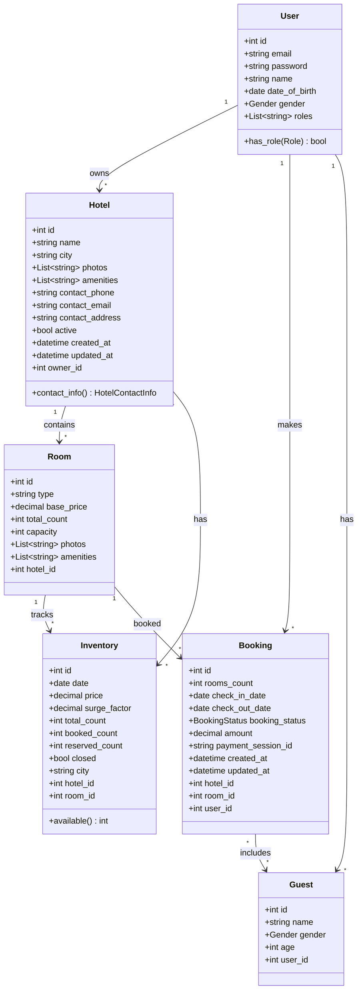
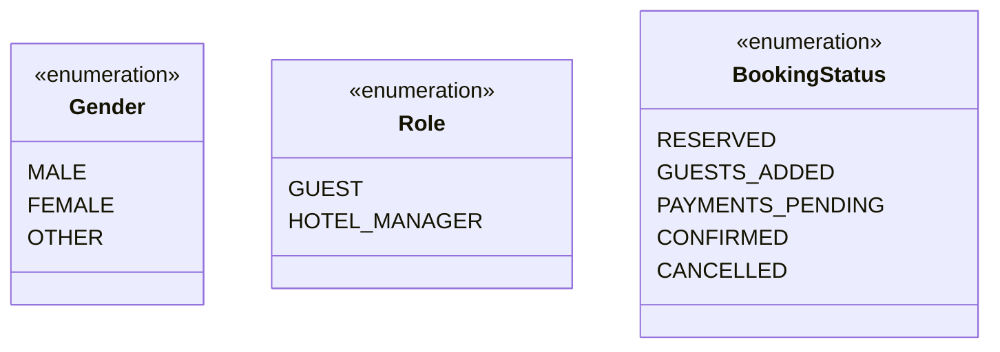
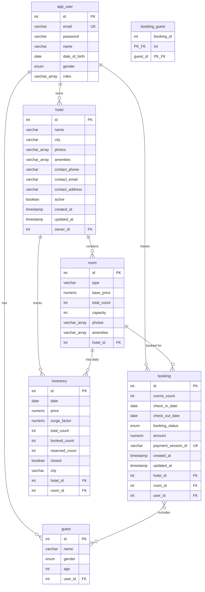
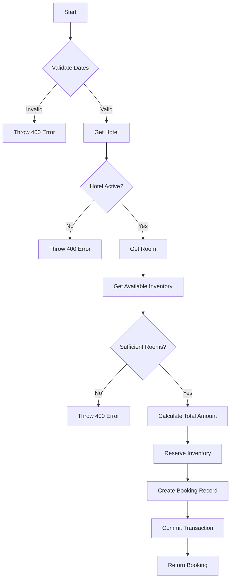
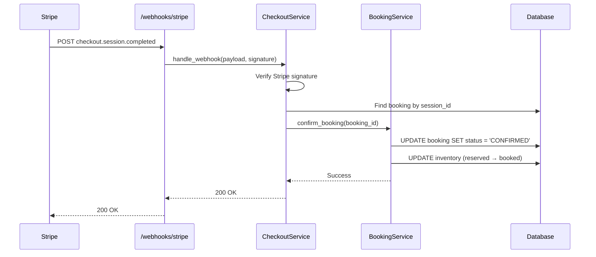
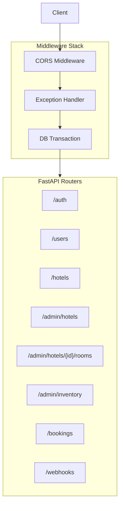
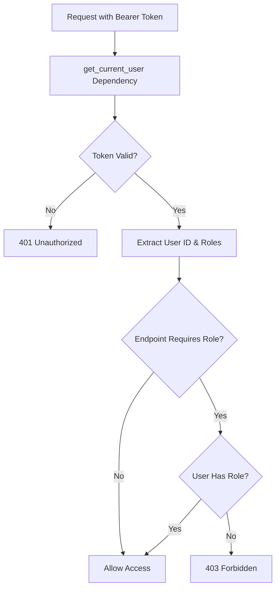
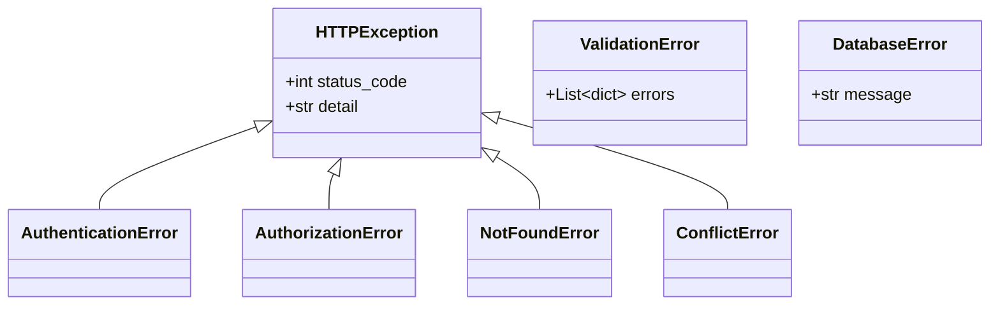

# Low-Level Design (LLD) Document

## AirBnb Hotel Booking System - FastAPI Backend

---

## 1. Introduction

This Low-Level Design (LLD) document provides detailed implementation specifications for the AirBnb Hotel Booking System. While the [HLD](./HLD.md) covers architecture and high-level flows, this document focuses on:

- **Class diagrams** with attributes and methods
- **Database schema** with exact column types
- **API contract** specifications
- **Algorithm details** for critical operations
- **Code-level design patterns**

---

## 2. Class Diagrams

### 2.1 Domain Model Overview



### 2.2 Enumerations



---

## 3. Database Schema

### 3.1 Table Definitions

#### 3.1.1 `app_user` Table

| Column          | Type                          | Constraints             | Description            |
| --------------- | ----------------------------- | ----------------------- | ---------------------- |
| `id`            | SERIAL                        | PRIMARY KEY             | Auto-increment ID      |
| `email`         | VARCHAR(255)                  | UNIQUE, NOT NULL, INDEX | User email             |
| `password`      | VARCHAR(255)                  | NOT NULL                | Bcrypt hashed password |
| `name`          | VARCHAR(255)                  | NULLABLE                | Display name           |
| `date_of_birth` | DATE                          | NULLABLE                | Birth date             |
| `gender`        | ENUM('MALE','FEMALE','OTHER') | NULLABLE                | Gender                 |
| `roles`         | VARCHAR[]                     | DEFAULT ['GUEST']       | Array of roles         |

**Indexes:**

- `idx_user_email` on `email` (unique)

**Design Reasoning:**

- Email is indexed for O(1) lookup during login
- Roles stored as array for flexibility (user can have multiple roles)
- Password stored as bcrypt hash (60 chars, but 255 for safety)

---

#### 3.1.2 `hotel` Table

| Column            | Type         | Constraints               | Description       |
| ----------------- | ------------ | ------------------------- | ----------------- |
| `id`              | SERIAL       | PRIMARY KEY               | Auto-increment ID |
| `name`            | VARCHAR(255) | NOT NULL                  | Hotel name        |
| `city`            | VARCHAR(255) | NULLABLE, INDEX           | City for search   |
| `photos`          | VARCHAR[]    | NULLABLE                  | Photo URLs        |
| `amenities`       | VARCHAR[]    | NULLABLE                  | Amenity list      |
| `contact_phone`   | VARCHAR(50)  | NULLABLE                  | Phone number      |
| `contact_email`   | VARCHAR(255) | NULLABLE                  | Contact email     |
| `contact_address` | VARCHAR(500) | NULLABLE                  | Address           |
| `active`          | BOOLEAN      | DEFAULT FALSE             | Is bookable       |
| `created_at`      | TIMESTAMP    | NOT NULL                  | Creation time     |
| `updated_at`      | TIMESTAMP    | NOT NULL                  | Last update       |
| `owner_id`        | INTEGER      | FK(app_user.id), NOT NULL | Owner reference   |

**Indexes:**

- `idx_hotel_city` on `city` (for search)
- `idx_hotel_owner` on `owner_id` (for owner queries)

**Design Reasoning:**

- `city` indexed for geographic search queries
- `active` flag allows soft-launch of hotels (setup before going live)
- Contact info as separate columns vs JSON for query flexibility

---

#### 3.1.3 `room` Table

| Column        | Type          | Constraints            | Description          |
| ------------- | ------------- | ---------------------- | -------------------- |
| `id`          | SERIAL        | PRIMARY KEY            | Auto-increment ID    |
| `type`        | VARCHAR(100)  | NOT NULL               | Room type name       |
| `base_price`  | NUMERIC(10,2) | NOT NULL               | Base price per night |
| `total_count` | INTEGER       | NOT NULL               | Total rooms of type  |
| `capacity`    | INTEGER       | NOT NULL               | Max guests per room  |
| `photos`      | VARCHAR[]     | NULLABLE               | Room photos          |
| `amenities`   | VARCHAR[]     | NULLABLE               | Room amenities       |
| `hotel_id`    | INTEGER       | FK(hotel.id), NOT NULL | Hotel reference      |

**Indexes:**

- `idx_room_hotel` on `hotel_id`

**Design Reasoning:**

- `base_price` is the default price; actual price varies via inventory
- `total_count` represents physical rooms; inventory tracks availability
- Cascade delete when hotel is deleted

---

#### 3.1.4 `inventory` Table

| Column           | Type          | Constraints            | Description             |
| ---------------- | ------------- | ---------------------- | ----------------------- |
| `id`             | SERIAL        | PRIMARY KEY            | Auto-increment ID       |
| `date`           | DATE          | NOT NULL               | Inventory date          |
| `price`          | NUMERIC(10,2) | NOT NULL               | Price for this date     |
| `surge_factor`   | NUMERIC(4,2)  | DEFAULT 1.0            | Price multiplier        |
| `total_count`    | INTEGER       | NOT NULL               | Total available         |
| `booked_count`   | INTEGER       | DEFAULT 0              | Confirmed bookings      |
| `reserved_count` | INTEGER       | DEFAULT 0              | Pending reservations    |
| `closed`         | BOOLEAN       | DEFAULT FALSE          | Manually closed         |
| `city`           | VARCHAR(255)  | INDEX                  | Denormalized for search |
| `hotel_id`       | INTEGER       | FK(hotel.id), NOT NULL | Hotel reference         |
| `room_id`        | INTEGER       | FK(room.id), NOT NULL  | Room reference          |

**Indexes:**

- `idx_inventory_room_date` on `(room_id, date)` (unique composite)
- `idx_inventory_city_date` on `(city, date)` (for search)

**Design Reasoning:**

- One row per room type per day
- `city` denormalized to avoid JOIN during search
- `reserved_count` tracks pending bookings (released on timeout/cancellation)
- Formula: `available = total_count - booked_count - reserved_count`

---

#### 3.1.5 `booking` Table

| Column               | Type          | Constraints               | Description       |
| -------------------- | ------------- | ------------------------- | ----------------- |
| `id`                 | SERIAL        | PRIMARY KEY               | Auto-increment ID |
| `rooms_count`        | INTEGER       | NOT NULL                  | Rooms booked      |
| `check_in_date`      | DATE          | NOT NULL                  | Check-in date     |
| `check_out_date`     | DATE          | NOT NULL                  | Check-out date    |
| `booking_status`     | ENUM          | NOT NULL                  | Current status    |
| `amount`             | NUMERIC(10,2) | NOT NULL                  | Total amount      |
| `payment_session_id` | VARCHAR(255)  | UNIQUE, NULLABLE          | Stripe session    |
| `created_at`         | TIMESTAMP     | NOT NULL                  | Created time      |
| `updated_at`         | TIMESTAMP     | NOT NULL                  | Last update       |
| `hotel_id`           | INTEGER       | FK(hotel.id), NOT NULL    | Hotel reference   |
| `room_id`            | INTEGER       | FK(room.id), NOT NULL     | Room reference    |
| `user_id`            | INTEGER       | FK(app_user.id), NOT NULL | User reference    |

**Indexes:**

- `idx_booking_user` on `user_id`
- `idx_booking_hotel` on `hotel_id`
- `idx_booking_payment` on `payment_session_id` (unique)

**Design Reasoning:**

- `payment_session_id` unique for idempotency in webhooks
- Status transitions enforced at application layer
- `amount` stored at booking time (prices may change later)

---

#### 3.1.6 `guest` Table

| Column    | Type         | Constraints               | Description       |
| --------- | ------------ | ------------------------- | ----------------- |
| `id`      | SERIAL       | PRIMARY KEY               | Auto-increment ID |
| `name`    | VARCHAR(255) | NOT NULL                  | Guest name        |
| `gender`  | ENUM         | NULLABLE                  | Gender            |
| `age`     | INTEGER      | NOT NULL                  | Guest age         |
| `user_id` | INTEGER      | FK(app_user.id), NOT NULL | Owner user        |

**Design Reasoning:**

- Guests are pre-saved profiles that can be reused across bookings
- Each guest belongs to exactly one user

---

#### 3.1.7 `booking_guest` Junction Table

| Column       | Type    | Constraints                 |
| ------------ | ------- | --------------------------- |
| `booking_id` | INTEGER | FK(booking.id), PRIMARY KEY |
| `guest_id`   | INTEGER | FK(guest.id), PRIMARY KEY   |

**Design Reasoning:**

- Many-to-many relationship between bookings and guests
- Composite primary key prevents duplicates

---

### 3.2 Entity Relationship Diagram (Detailed)



---

## 4. Service Layer Design

### 4.1 Service Class Diagram

```mermaid
classDiagram
    class AuthService {
        -AsyncSession db
        +signup(UserCreate) UserResponse
        +login(UserLogin) tuple[str, str]
        +refresh_token(str) str
    }

    class UserService {
        -AsyncSession db
        +update_profile(User, ProfileUpdate) UserResponse
    }

    class HotelService {
        -AsyncSession db
        +create_hotel(HotelCreate, User) HotelResponse
        +get_hotels_by_owner(User) List~Hotel~
        +get_hotel(int) Hotel
        +update_hotel(int, HotelUpdate, User) Hotel
        +delete_hotel(int, User) void
        +activate_hotel(int, User) Hotel
        -_verify_ownership(int, User) void
    }

    class RoomService {
        -AsyncSession db
        +create_room(int, RoomCreate, User) Room
        +get_rooms(int) List~Room~
        +get_room(int, int) Room
        +update_room(int, int, RoomUpdate, User) Room
        +delete_room(int, int, User) void
        -_verify_hotel_ownership(int, User) void
    }

    class InventoryService {
        -AsyncSession db
        +get_inventory(int, int, date, date, User) List~Inventory~
        +update_inventory(int, int, List~InventoryUpdate~, User) List~Inventory~
        -_verify_hotel_ownership(int, User) void
    }

    class BookingService {
        -AsyncSession db
        +initialise_booking(BookingCreate, User) Booking
        +add_guests(int, List~int~, User) Booking
        +get_booking_status(int, User) BookingStatus
        +cancel_booking(int, User) void
        +confirm_booking(int) void
        +get_all_bookings_by_hotel_id(int, User) List~Booking~
        +get_hotel_report(int, date, date, User) HotelReportResponse
        +get_user_bookings(User) List~Booking~
        -_get_available_inventory(int, date, date, int) List~Inventory~
        -_reserve_inventory(int, date, date, int) void
        -_release_inventory(int, date, date, int) void
        -_confirm_inventory(int, date, date, int) void
    }

    class CheckoutService {
        -AsyncSession db
        +create_checkout_session(int, User) str
        +handle_webhook(bytes, str) void
        -_verify_booking_ownership(int, User) Booking
    }

    class GuestService {
        -AsyncSession db
        +create_guest(GuestCreate, User) Guest
        +get_guests(User) List~Guest~
        +update_guest(int, GuestUpdate, User) Guest
        +delete_guest(int, User) void
        -_get_user_guest(int, User) Guest
    }

    AuthService --> User : manages
    HotelService --> Hotel : manages
    RoomService --> Room : manages
    InventoryService --> Inventory : manages
    BookingService --> Booking : manages
    BookingService --> Inventory : updates
    CheckoutService --> Booking : processes
    GuestService --> Guest : manages
```



### 4.2 Service Method Details

#### 4.2.1 BookingService.initialise_booking()

**Purpose:** Create a new booking reservation with inventory lock.

**Algorithm:**



**Code Logic:**

```python
async def initialise_booking(self, booking_data: BookingCreate, user: User):
    # 1. Validate dates
    if booking_data.check_in_date >= booking_data.check_out_date:
        raise HTTPException(400, "Invalid date range")

    # 2. Verify hotel is active
    hotel = await self._get_hotel(booking_data.hotel_id)
    if not hotel.active:
        raise HTTPException(400, "Hotel not active")

    # 3. Verify room exists in hotel
    room = await self._get_room(booking_data.room_id, booking_data.hotel_id)

    # 4. Check availability for all dates
    inventory_list = await self._get_available_inventory(
        room.id,
        booking_data.check_in_date,
        booking_data.check_out_date,
        booking_data.rooms_count
    )

    # 5. Calculate total amount
    total_amount = sum(
        inv.price * inv.surge_factor * booking_data.rooms_count
        for inv in inventory_list
    )

    # 6. Reserve inventory (increment reserved_count)
    await self._reserve_inventory(
        room.id,
        booking_data.check_in_date,
        booking_data.check_out_date,
        booking_data.rooms_count
    )

    # 7. Create booking record
    booking = Booking(
        rooms_count=booking_data.rooms_count,
        check_in_date=booking_data.check_in_date,
        check_out_date=booking_data.check_out_date,
        booking_status=BookingStatus.RESERVED,
        amount=total_amount,
        hotel_id=booking_data.hotel_id,
        room_id=booking_data.room_id,
        user_id=user.id
    )

    self.db.add(booking)
    await self.db.commit()
    return booking
```

---

#### 4.2.2 Inventory Availability Check Algorithm

**Problem:** Check if `N` rooms are available for all dates in a range.

**SQL Query:**

```sql
SELECT * FROM inventory
WHERE room_id = :room_id
  AND date >= :check_in
  AND date < :check_out
  AND closed = false
  AND (total_count - booked_count - reserved_count) >= :rooms_count
```

**Time Complexity:** O(d) where d = number of days

**Edge Cases:**

- Check-out date is exclusive (guest leaves that morning)
- Inventory may not exist for future dates (needs initialization)

---

#### 4.2.3 Payment Confirmation Flow



---

## 5. API Layer Design

### 5.1 Router Structure



### 5.2 Endpoint Specifications

#### 5.2.1 Authentication Endpoints

| Method | Endpoint        | Auth   | Request      | Response        |
| ------ | --------------- | ------ | ------------ | --------------- |
| POST   | `/auth/signup`  | ❌     | `UserCreate` | `UserResponse`  |
| POST   | `/auth/login`   | ❌     | `UserLogin`  | `TokenResponse` |
| POST   | `/auth/refresh` | Cookie | -            | `TokenResponse` |

---

#### 5.2.2 Hotel Management Endpoints

| Method | Endpoint                      | Auth | Role          | Request       | Response              |
| ------ | ----------------------------- | ---- | ------------- | ------------- | --------------------- |
| GET    | `/admin/hotels`               | ✅   | HOTEL_MANAGER | -             | `List[HotelResponse]` |
| POST   | `/admin/hotels`               | ✅   | HOTEL_MANAGER | `HotelCreate` | `HotelResponse`       |
| GET    | `/admin/hotels/{id}`          | ✅   | HOTEL_MANAGER | -             | `HotelResponse`       |
| PUT    | `/admin/hotels/{id}`          | ✅   | HOTEL_MANAGER | `HotelUpdate` | `HotelResponse`       |
| DELETE | `/admin/hotels/{id}`          | ✅   | HOTEL_MANAGER | -             | 204                   |
| PATCH  | `/admin/hotels/{id}/activate` | ✅   | HOTEL_MANAGER | -             | `HotelResponse`       |

---

#### 5.2.3 Booking Endpoints

| Method | Endpoint                  | Auth | Request         | Response                |
| ------ | ------------------------- | ---- | --------------- | ----------------------- |
| POST   | `/bookings/init`          | ✅   | `BookingCreate` | `BookingResponse`       |
| POST   | `/bookings/{id}/guests`   | ✅   | `List[int]`     | `BookingResponse`       |
| POST   | `/bookings/{id}/payments` | ✅   | -               | `{session_url}`         |
| GET    | `/bookings/{id}/status`   | ✅   | -               | `BookingStatus`         |
| DELETE | `/bookings/{id}`          | ✅   | -               | 204                     |
| GET    | `/bookings/me`            | ✅   | -               | `List[BookingResponse]` |

---

### 5.3 Pydantic Schema Definitions

#### 5.3.1 User Schemas

```python
class UserCreate(BaseModel):
    email: EmailStr
    password: str = Field(..., min_length=6, max_length=100)
    name: Optional[str] = Field(None, max_length=255)

class UserLogin(BaseModel):
    email: EmailStr
    password: str

class UserResponse(BaseModel):
    id: int
    email: str
    name: Optional[str]
    gender: Optional[Gender]
    date_of_birth: Optional[date]
    roles: List[str]

    model_config = ConfigDict(from_attributes=True)

class ProfileUpdate(BaseModel):
    name: Optional[str] = Field(None, max_length=255)
    gender: Optional[Gender] = None
    date_of_birth: Optional[date] = None
```

---

#### 5.3.2 Booking Schemas

```python
class BookingCreate(BaseModel):
    hotel_id: int
    room_id: int
    check_in_date: date
    check_out_date: date
    rooms_count: int = Field(..., ge=1)

class BookingResponse(BaseModel):
    id: int
    hotel_id: int
    room_id: int
    rooms_count: int
    check_in_date: date
    check_out_date: date
    booking_status: BookingStatus
    amount: Decimal
    created_at: datetime

    model_config = ConfigDict(from_attributes=True)

class HotelReportResponse(BaseModel):
    hotel_id: int
    booking_count: int
    total_revenue: Decimal
    average_booking_value: Decimal
```

---

## 6. Security Implementation

### 6.1 Password Hashing

```python
import bcrypt

def hash_password(password: str) -> str:
    """Hash password using bcrypt."""
    # Truncate to 72 bytes (bcrypt limit)
    password_bytes = password.encode('utf-8')[:72]
    salt = bcrypt.gensalt(rounds=12)
    return bcrypt.hashpw(password_bytes, salt).decode('utf-8')

def verify_password(plain: str, hashed: str) -> bool:
    """Verify password against hash."""
    plain_bytes = plain.encode('utf-8')[:72]
    hashed_bytes = hashed.encode('utf-8')
    return bcrypt.checkpw(plain_bytes, hashed_bytes)
```

**Design Decisions:**

- **Bcrypt over Argon2:** Wider library support, sufficient security
- **12 rounds:** Balance between security and performance (~300ms)
- **72-byte truncation:** Bcrypt limitation, explicit handling prevents errors

---

### 6.2 JWT Token Structure

```python
# Access Token Payload
{
    "sub": "123",           # User ID as string
    "roles": ["GUEST"],     # User roles
    "type": "access",       # Token type
    "exp": 1707400000,      # Expiry (30 min from now)
    "iat": 1707398200       # Issued at
}

# Refresh Token Payload
{
    "sub": "123",           # User ID as string
    "type": "refresh",      # Token type
    "exp": 1707998200,      # Expiry (7 days from now)
    "iat": 1707398200       # Issued at
}
```

**Security Measures:**

- Access token: Short-lived (30 min)
- Refresh token: HTTP-only cookie (prevents XSS)
- Token type in payload prevents token swap attacks

---

### 6.3 Authorization Flow



**Dependency Implementation:**

```python
async def get_current_user(
    token: str = Depends(oauth2_scheme),
    db: AsyncSession = Depends(get_db)
) -> User:
    payload = verify_token(token, token_type="access")
    if not payload:
        raise HTTPException(401, "Invalid token")

    user_id = int(payload.get("sub"))
    user = await db.get(User, user_id)
    if not user:
        raise HTTPException(401, "User not found")

    return user

def require_role(role: Role):
    async def role_checker(user: User = Depends(get_current_user)):
        if not user.has_role(role):
            raise HTTPException(403, "Insufficient permissions")
        return user
    return role_checker
```

---

## 7. Database Connection Management

### 7.1 Async Session Configuration

```python
from sqlalchemy.ext.asyncio import (
    create_async_engine,
    AsyncSession,
    async_sessionmaker
)

# Engine configuration
engine = create_async_engine(
    DATABASE_URL,
    echo=False,           # Disable SQL logging in production
    pool_pre_ping=True,   # Verify connections before use
    pool_size=10,         # Connection pool size
    max_overflow=20,      # Extra connections allowed
)

# Session factory
async_session = async_sessionmaker(
    engine,
    class_=AsyncSession,
    expire_on_commit=False  # Prevent detached instance errors
)

# Dependency
async def get_db() -> AsyncGenerator[AsyncSession, None]:
    async with async_session() as session:
        async with session.begin():
            yield session
        # Auto-commit on success, rollback on exception
```

**Design Reasoning:**

- `pool_pre_ping`: Handles connection drops gracefully
- `expire_on_commit=False`: Allows accessing attributes after commit
- Context manager ensures proper cleanup

---

## 8. Error Handling

### 8.1 Exception Hierarchy



### 8.2 Global Exception Handler

```python
@app.exception_handler(Exception)
async def global_exception_handler(request: Request, exc: Exception):
    if isinstance(exc, HTTPException):
        return JSONResponse(
            status_code=exc.status_code,
            content={"detail": exc.detail}
        )

    # Log unexpected errors
    logger.error(f"Unexpected error: {exc}", exc_info=True)

    return JSONResponse(
        status_code=500,
        content={"detail": "Internal server error"}
    )
```

---

## 9. Testing Strategy

### 9.1 Test Structure

```
tests/
├── conftest.py           # Fixtures
├── test_auth.py          # 9 tests
├── test_hotels.py        # 12 tests
├── test_rooms.py         # 7 tests
├── test_inventory.py     # 4 tests
├── test_bookings.py      # 7 tests
├── test_users.py         # 11 tests
└── test_browse.py        # 5 tests
```

### 9.2 Test Fixtures

```python
@pytest_asyncio.fixture
async def client():
    """Async test client with test database."""
    async with AsyncClient(
        transport=ASGITransport(app=app),
        base_url="http://test"
    ) as ac:
        yield ac

@pytest_asyncio.fixture
async def auth_headers(client):
    """Get authenticated headers for tests."""
    # Signup
    await client.post("/auth/signup", json={
        "email": "test@example.com",
        "password": "test123"
    })

    # Login
    response = await client.post("/auth/login", data={
        "username": "test@example.com",
        "password": "test123"
    })
    token = response.json()["access_token"]

    return {"Authorization": f"Bearer {token}"}
```

---

## 10. File Structure Reference

```
app/
├── main.py                 # FastAPI entrypoint, router registration
├── config.py               # Environment settings (Pydantic BaseSettings)
├── database.py             # Async engine, session, Base class
├── models/
│   ├── __init__.py         # Model exports
│   ├── enums.py            # Gender, Role, BookingStatus
│   ├── user.py             # User model
│   ├── hotel.py            # Hotel model + HotelContactInfo
│   ├── room.py             # Room model
│   ├── inventory.py        # Inventory model
│   ├── booking.py          # Booking model + booking_guest table
│   ├── guest.py            # Guest model
│   └── hotel_min_price.py  # Materialized view for search
├── schemas/
│   ├── __init__.py         # Schema exports
│   ├── common.py           # Shared schemas
│   ├── user.py             # User DTOs
│   ├── hotel.py            # Hotel DTOs
│   ├── room.py             # Room DTOs
│   ├── inventory.py        # Inventory DTOs
│   ├── booking.py          # Booking DTOs
│   └── guest.py            # Guest DTOs
├── routers/
│   ├── auth.py             # /auth endpoints
│   ├── users.py            # /users endpoints
│   ├── hotels.py           # /admin/hotels endpoints
│   ├── rooms.py            # /admin/hotels/{id}/rooms endpoints
│   ├── inventory.py        # /admin/inventory endpoints
│   ├── bookings.py         # /bookings endpoints
│   ├── browse.py           # /hotels (public) endpoints
│   └── webhooks.py         # /webhooks endpoints
├── services/
│   ├── __init__.py         # Service exports
│   ├── auth_service.py     # Authentication logic
│   ├── user_service.py     # User profile logic
│   ├── hotel_service.py    # Hotel management
│   ├── room_service.py     # Room management
│   ├── inventory_service.py# Inventory management
│   ├── booking_service.py  # Booking logic (280 lines)
│   ├── checkout_service.py # Stripe integration
│   └── guest_service.py    # Guest management
├── security/
│   ├── jwt.py              # Token creation & verification
│   ├── password.py         # Bcrypt hashing
│   └── dependencies.py     # Auth dependencies
└── exceptions/
    └── handlers.py         # Global exception handlers
```

---

## 11. Appendix

### A. SQL Migration Example (Alembic)

```python
# alembic/versions/001_initial.py
def upgrade():
    op.create_table(
        'app_user',
        sa.Column('id', sa.Integer, primary_key=True),
        sa.Column('email', sa.String(255), unique=True, nullable=False),
        sa.Column('password', sa.String(255), nullable=False),
        sa.Column('name', sa.String(255)),
        sa.Column('date_of_birth', sa.Date),
        sa.Column('gender', sa.Enum('MALE', 'FEMALE', 'OTHER', name='gender')),
        sa.Column('roles', sa.ARRAY(sa.String), default=['GUEST'])
    )
    op.create_index('idx_user_email', 'app_user', ['email'])
```

### B. Quick Reference

| Component | Count | Lines of Code |
| --------- | ----- | ------------- |
| Models    | 7     | ~300          |
| Services  | 8     | ~600          |
| Routers   | 8     | ~400          |
| Schemas   | 8     | ~200          |
| Tests     | 55+   | ~800          |
| **Total** | -     | **~2,300**    |

---

_Document Version: 1.0_  
_Last Updated: 2026-02-08_  
_Based on HLD v1.1_
